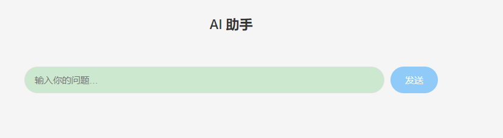
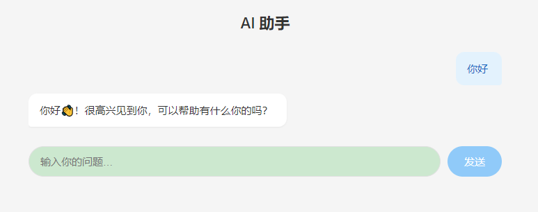
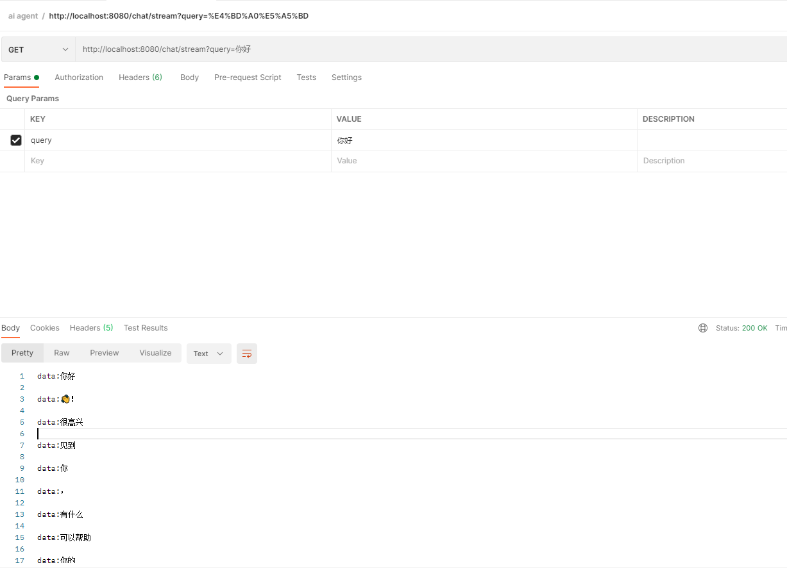

# 第一期：项目开篇与流式聊天

## 前言

本系列文章记录了我学习 **Spring AI Alibaba** 并构建一个智能对话 Agent 的完整过程。项目完整代码已上传至 GitHub：[tenny-peng/spring-ai-agent-demo](https://github.com/tenny-peng/spring-ai-agent-demo)

在开始之前，有必要说明一下这个"从零"其实并不那么"从零"。

我是在 B 站看了这个视频入门 Spring AI Alibaba 的基础知识的：
[【Spring AI Alibaba 框架教程】](https://www.bilibili.com/video/BV1eyWbzEEnw/)

视频中讲解了 Spring AI Alibaba 的核心概念和基本用法，比如：

- 基本的依赖配置
- ChatModel和ChatClient的使用
- Prompt的构建方式
- 向量数据库（redis-stack）的使用，对话加入RAG
- tools到MCP的使用
- graph的使用，包括条件边，循环边

本篇不会重复这些基础内容，而是假设读者已经看过视频或掌握了上述基本知识，然后把这些技术运用到一个综合性的实战项目中。我们的目标是构建一个可扩展的 Agent 系统，而不仅仅是一个 Hello World。

---

## 项目结构概览

```
spring-ai-agent-demo/
├── app/               # 主应用模块（本篇的重点）
│   ├── pom.xml
│   └── src/main/
│       ├── java/com/tenny/
│       │   ├── AppApplication.java
│       │   ├── config/GraphConfig.java
│       │   ├── controller/ChatController.java
│       │   └── node/ChatNode.java
│       └── resources/
│           ├── application.yml
│           └── static/        # 前端构建产物
├── chatbot/           # ChatClient 基础学习模块
├── graph/             # Graph 框架学习模块
├── rag/               # RAG 学习模块
├── mcp-server/        # MCP Server 学习模块
└── frontend/          # app对应的Vue 3 前端项目
```

整个项目是一个 Maven 多模块工程，`app` + `frontend`是本次项目的应用模块，其他模块是单独学习各个技术时使用的独立实验项目。

---

## 依赖配置

### 父 POM（版本管理）

```xml
<!-- pom.xml -->
<parent>
    <groupId>org.springframework.boot</groupId>
    <artifactId>spring-boot-starter-parent</artifactId>
    <version>3.5.7</version>
</parent>

<properties>
    <java.version>17</java.version>
    <spring-ai.version>1.1.2</spring-ai.version>
    <spring-ai-alibaba.version>1.1.2.2</spring-ai-alibaba.version>
</properties>

<dependencyManagement>
    <dependencies>
        <dependency>
            <groupId>org.springframework.ai</groupId>
            <artifactId>spring-ai-bom</artifactId>
            <version>${spring-ai.version}</version>
            <type>pom</type>
            <scope>import</scope>
        </dependency>
        <dependency>
            <groupId>com.alibaba.cloud.ai</groupId>
            <artifactId>spring-ai-alibaba-bom</artifactId>
            <version>${spring-ai-alibaba.version}</version>
            <type>pom</type>
            <scope>import</scope>
        </dependency>
    </dependencies>
</dependencyManagement>
```

### app 模块 POM

```xml
<dependencies>
    <dependency>
        <groupId>org.springframework.boot</groupId>
        <artifactId>spring-boot-starter-web</artifactId>
    </dependency>
    <dependency>
        <groupId>org.springframework.ai</groupId>
        <artifactId>spring-ai-starter-model-zhipuai</artifactId>
    </dependency>
    <dependency>
        <groupId>com.alibaba.cloud.ai</groupId>
        <artifactId>spring-ai-alibaba-graph-core</artifactId>
    </dependency>
    <dependency>
        <groupId>org.projectlombok</groupId>
        <artifactId>lombok</artifactId>
        <scope>provided</scope>
    </dependency>
</dependencies>
```

三个核心依赖：

- **`spring-boot-starter-web`** — Web 容器，提供 REST API
- **`spring-ai-starter-model-zhipuai`** — Spring AI 的智谱 AI 接入 starter
- **`spring-ai-alibaba-graph-core`** — Spring AI Alibaba 的状态图编排框架（Agent 的核心）

---

## 配置文件

```yaml
# application.yml
server:
  port: 8080

spring:
  ai:
    zhipuai:
      api-key: ${ZHIPUAI_API_KEY}
      chat:
        options:
          model: glm-4-flash
          temperature: 0.7
```

API Key 通过环境变量 `ZHIPUAI_API_KEY` 注入，避免硬编码。模型使用性价比高的 `glm-4-flash`。

---

## Graph 状态图编排

为什么一上来就用 Graph？因为后续我们要加入记忆、工具调用、RAG、联网搜索等功能，这些都需要一个灵活的状态管理框架来编排。Spring AI Alibaba 的 **StateGraph** 就是做这个的——它像一个有限状态机，每个节点执行一个动作，节点之间通过边连接，状态在节点间传递。

```java
@Slf4j
@Configuration
public class GraphConfig {

    @Bean("chatbotGraph")
    public CompiledGraph chatbotGraph(ChatClient.Builder builder) throws GraphStateException {
        // 定义状态策略：query 字段使用替换策略（每次覆盖）
        KeyStrategyFactory keyStrategyFactory = () -> Map.of("query", new ReplaceStrategy());

        StateGraph stateGraph = new StateGraph("chatbotGraph", keyStrategyFactory);

        // 添加节点
        stateGraph.addNode("ChatNode", AsyncNodeAction.node_async(new ChatNode(builder)));

        // 连接边：START → ChatNode → END
        stateGraph.addEdge(StateGraph.START, "ChatNode");
        stateGraph.addEdge("ChatNode", StateGraph.END);

        return stateGraph.compile();
    }
}
```

**关键点：**

- **`KeyStrategyFactory`** — 定义状态中每个字段的更新策略，`ReplaceStrategy` 表示每次覆盖旧值
- **`AsyncNodeAction.node_async()`** — 将同步的 `NodeAction` 包装为异步执行
- **`compile()`** — 编译图，返回 `CompiledGraph`，之后通过它来执行

当前 Graph 还很简单，只有一条直线（START → ChatNode → END），后面我们会逐步添加更多节点和条件路由。

---

## ChatNode：LLM 调用节点

```java
public class ChatNode implements NodeAction {

    private final ChatClient chatClient;

    public ChatNode(ChatClient.Builder builder) {
        this.chatClient = builder.build();
    }

    @Override
    public Map<String, Object> apply(OverAllState state) throws Exception {
        String query = state.value("query", "");
        Flux<String> stream = chatClient.prompt()
                .system("你是一个有用的AI助手")
                .user(query)
                .stream()
                .content();
        return Map.of("output", stream);
    }
}
```

**这是实现流式输出的关键！**

普通的同步调用是 `chatClient.prompt().call().content()`，它会阻塞直到模型返回完整结果。而这里我们用了 `stream().content()`，返回一个 **`Flux<String>`**（Reactor 的响应式流），每个 String 是模型输出的一个 token 块。

这个 `Flux<String>` 被放入返回的 `Map` 中，Graph 引擎的 `NodeExecutor` 内部有一个名为 `getEmbedFlux()` 的检测机制——它会扫描节点返回的 `Map`，如果某个 value 是 `Flux` 类型，就自动将其转换为逐 token 的 `StreamingOutput` 事件，通过 `compiledGraph.stream()` 实时发出。

---

## ChatController：流式 SSE 端点

```java
@RestController
@RequestMapping("chat")
@RequiredArgsConstructor
public class ChatController {

    private final CompiledGraph compiledGraph;

    @GetMapping(value = "stream", produces = MediaType.TEXT_EVENT_STREAM_VALUE)
    public Flux<String> stream(@RequestParam String query) {
        return compiledGraph.stream(Map.of("query", query))
                .ofType(StreamingOutput.class)
                .map(so -> (String) so.getOriginData());
    }
}
```

**几个要点：**

1. **`compiledGraph.stream()`** — 以流模式执行 Graph，返回 `Flux<NodeOutput>`，每个节点完成时发射一个事件
2. **`.ofType(StreamingOutput.class)`** — 过滤出流式输出事件（当节点返回 `Flux` 时，Graph 引擎会为每个 token 发射 `StreamingOutput`）
3. **`.map(so -> (String) so.getOriginData())`** — 提取 token 文本（注意不是 `so.chunk()`，因为 Graph 引擎内部将 map key 存入了 `chunk` 字段，真正的文本内容在 `originData` 中）
4. **`produces = MediaType.TEXT_EVENT_STREAM_VALUE`** — 声明为 SSE，否则 Spring MVC 会缓存整个响应

> 这里有个小坑：`StreamingOutput.chunk()` 存的是 Map 的 key（即 `"output"`），而不是实际的 token 文本。实际文本在 `getOriginData()` 中。这是通过分析 Graph 引擎的字节码发现的，在 `GraphRunnerContext.buildStreamingOutput()` 中可以看到：
> `new StreamingOutput<>(data /*originData*/, key /*chunk*/, ...)`

---

## 前端：Vue 3 + Vite + EventSource

前端采用 Vue 3 + Vite，放在独立的 `frontend/` 目录中，与后端解耦。

### Vite 配置

```typescript
// vite.config.ts
export default defineConfig({
  plugins: [vue()],
  server: {
    port: 5173,
    proxy: {
      '/chat': {
        target: 'http://localhost:8080',
        changeOrigin: true,
      },
    },
  },
  build: {
    outDir: '../app/src/main/resources/static',
    emptyOutDir: true,
  },
})
```

- 开发时通过 proxy 将 `/chat` 请求转发到后端 8080，避免跨域
- 构建时产物直接输出到后端的 `static/` 目录，`mvn spring-boot:run` 即可一并托管

### ChatView 组件核心逻辑

```vue
<script setup lang="ts">
function send() {
  // 1. 添加用户消息到列表
  messages.value.push({ role: 'user', content: text })

  // 2. 创建一个空白的 AI 消息占位
  const assistantMsg: Message = { role: 'assistant', content: '' }
  messages.value.push(assistantMsg)

  // 3. 建立 SSE 连接
  const es = new EventSource('/chat/stream?query=' + encodeURIComponent(text))

  // 4. 每收到一个 token，追加到 AI 消息末尾
  es.onmessage = (e) => {
    assistantMsg.content += e.data  // 逐 token 追加
  }

  // 5. 出错或结束时关闭连接
  es.onerror = () => {
    es.close()
  }
}
</script>
```

前端使用浏览器原生 `EventSource` API 接收 SSE 流，每次收到 `onmessage` 事件，就把 token 追加到当前 AI 消息的内容中，Vue 的响应式机制会自动更新 DOM。

---

## 启动与效果

### 启动方式一：仅后端（访问静态页面）

```bash
cd app && mvn spring-boot:run
```

浏览器打开 `http://localhost:8080`

### 启动方式二：前后端分离开发（带热更新）

```bash
# 终端1：后端
cd app && mvn spring-boot:run

# 终端2：前端（热更新）
cd frontend && npm run dev
```

浏览器打开 `http://localhost:5173`，修改前端代码自动热更新

---

## 效果展示








---

## 踩坑记录

1. **StreamingOutput.chunk 拿不到正确文本** — 一开始用了 `StreamingOutput::chunk`，结果每个 token 都是 `"output"` 字符串。反编译 Graph 引擎后发现 `chunk` 字段存的是 Map key，实际内容在 `originData` 中
2. **Flux 流不输出** — 忘记加 `produces = MediaType.TEXT_EVENT_STREAM_VALUE`，Spring MVC 把整个 Flux 缓存后一次性返回
3. **EventSource 跨域** — 开发时前端 5173 → 后端 8080，通过 Vite proxy 解决

---

## 下期预告

第二期将引入 **对话记忆与会话隔离**——通过 `RunnableConfig.threadId` 实现多用户会话隔离，让 AI 记住上下文。
