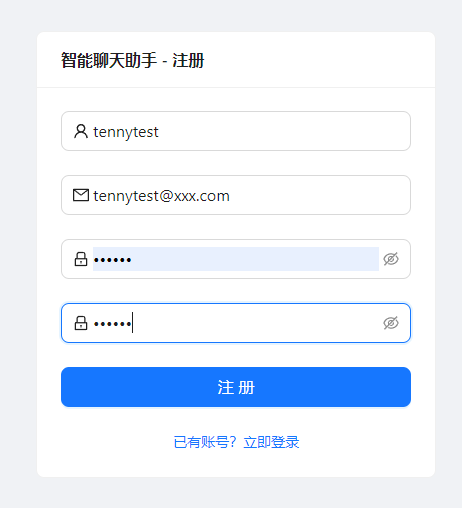
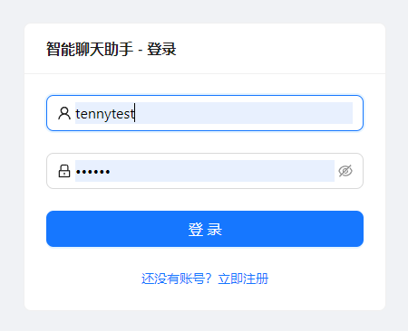
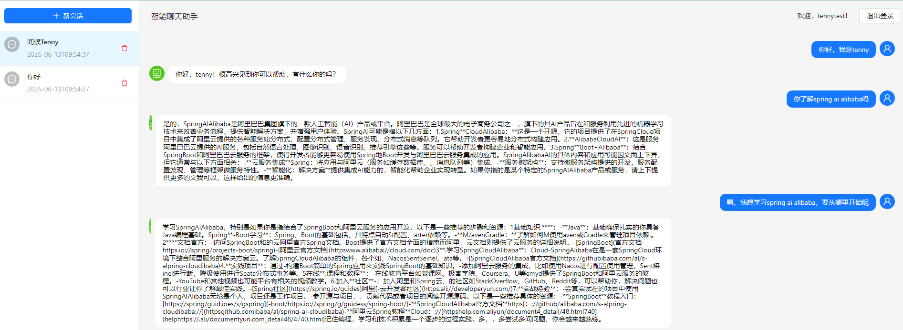
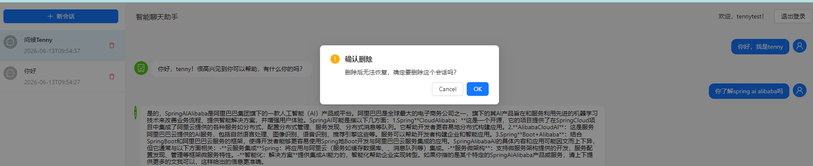
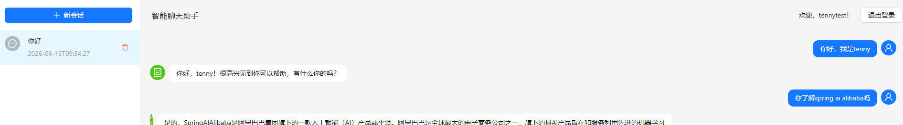

# 第二期：用户认证、多轮对话与会话隔离

## 前言

[第一期](https://www.cnblogs.com/)我们搭建了一个简单的流式聊天 Agent，使用 Spring AI Alibaba 的 StateGraph 编排 LLM 调用，前端用 Vue 3 + EventSource 接收 SSE 流式响应。

但那个版本离一个可用的产品还有很大距离——没有用户系统、没有会话管理、AI 每次都是"一问一答"，记不住上下文。

本期我们补齐这些短板：

- **用户注册 & 登录** — 基于 Token 认证，密码 BCrypt 加密
- **多轮对话** — AI 能记住同一会话中的历史消息
- **会话隔离** — 不同用户、不同会话互不干扰
- **会话管理** — 新建、删除、重命名，自动生成标题
- **前端的完全重构** — Vue 3 → **React + Ant Design**

---

## 新增依赖一览

与第一期相比，pom.xml 中新增了以下依赖：

```xml
<!-- MyBatis-Plus + MySQL -->
<dependency>
    <groupId>com.baomidou</groupId>
    <artifactId>mybatis-plus-spring-boot3-starter</artifactId>
    <version>3.5.9</version>
</dependency>
<dependency>
    <groupId>com.mysql</groupId>
    <artifactId>mysql-connector-j</artifactId>
    <scope>runtime</scope>
</dependency>

<!-- Redis + Redisson -->
<dependency>
    <groupId>org.springframework.boot</groupId>
    <artifactId>spring-boot-starter-data-redis</artifactId>
</dependency>
<dependency>
    <groupId>org.redisson</groupId>
    <artifactId>redisson-spring-boot-starter</artifactId>
    <version>3.22.0</version>
</dependency>

<!-- 密码加密 -->
<dependency>
    <groupId>org.springframework.security</groupId>
    <artifactId>spring-security-crypto</artifactId>
</dependency>

<!-- 参数校验 -->
<dependency>
    <groupId>org.springframework.boot</groupId>
    <artifactId>spring-boot-starter-validation</artifactId>
</dependency>

<!-- FastJSON2 -->
<dependency>
    <groupId>com.alibaba.fastjson2</groupId>
    <artifactId>fastjson2</artifactId>
    <version>2.0.53</version>
</dependency>
```

**为什么要引入 MySQL + MyBatis-Plus？**

第一期没有数据库，会话数据无从持久化。本期的用户信息、会话元数据（标题、创建时间等）都存入 MySQL。MyBatis-Plus 提供了开箱即用的 CRUD，无需写 XML。

**为什么要引入 Redis + Redisson？**

两件事需要 Redis：
1. **Token 存储** — 用户登录后生成一个 token 存入 Redis，后续请求通过 token 识别用户
2. **Graph 状态持久化** — Spring AI Alibaba 的 `RedisSaver` 可以将 Graph 的执行状态（即对话历史）持久化到 Redis，实现多轮对话记忆

Redisson 除了作为 Redis 客户端，还提供了分布式锁，用于并发场景下安全地更新对话状态。

---

## 数据库设计

只有两张表：

```sql
CREATE TABLE IF NOT EXISTS `user` (
    `id` BIGINT AUTO_INCREMENT PRIMARY KEY,
    `username` VARCHAR(50) NOT NULL UNIQUE,
    `email` VARCHAR(128) NOT NULL,
    `password` VARCHAR(255) NOT NULL,
    `created_at` DATETIME DEFAULT CURRENT_TIMESTAMP,
    `updated_at` DATETIME DEFAULT CURRENT_TIMESTAMP ON UPDATE CURRENT_TIMESTAMP
) ENGINE=InnoDB DEFAULT CHARSET=utf8mb4;

CREATE TABLE IF NOT EXISTS `conversation` (
    `id` BIGINT AUTO_INCREMENT PRIMARY KEY,
    `user_id` BIGINT NOT NULL,
    `conversation_id` VARCHAR(64) NOT NULL UNIQUE,
    `title` VARCHAR(255) DEFAULT '新对话',
    `status` VARCHAR(20) DEFAULT 'active',
    `message_count` INT DEFAULT 0,
    `created_at` DATETIME DEFAULT CURRENT_TIMESTAMP,
    `updated_at` DATETIME DEFAULT CURRENT_TIMESTAMP ON UPDATE CURRENT_TIMESTAMP,
    INDEX `idx_user_id` (`user_id`)
) ENGINE=InnoDB DEFAULT CHARSET=utf8mb4;
```

`schema.sql` 配置了 `spring.sql.init.mode=always`，启动时自动建表。

---

## 后端架构演进


本期后端新增了大量的包和类，按功能分层：

```
com.tenny/
├── annotation/    AuthRequired.java      # 权限注解
├── common/        ApiResult, UserContext # 统一返回体 & ThreadLocal用户上下文
├── config/        GraphConfig, RedisConfig, WebMvcConfig
├── controller/
│   ├── api/       AuthController, ConversationController  # 前端调用的接口
│   └── admin/     AdminUserController, AdminConversationController  # 预留管理端
├── entity/        User, Conversation     # 数据库实体
│   └── dto/       AuthRequest, LoginResponse, ChangeTitleReq
├── graphnode/     ChatNode               # Graph 节点（大幅改造）
├── interceptor/   AuthInterceptor        # Token 校验拦截器
├── mapper/        UserMapper, ConversationMapper  # MyBatis-Plus 接口
├── service/       UserService, ConversationService
│   └── impl/      UserServiceImpl, ConversationServiceImpl
└── utils/         TokenUtils             # Token 提取工具
```

---

## 用户认证系统

### 注册

`AuthController.register()` 接收用户名、邮箱、密码，密码使用 `BCryptPasswordEncoder` 加密后存入数据库：

```java
// UserServiceImpl
public User register(String username, String email, String password) {
    // 检查用户名、邮箱是否已存在
    User user = new User();
    user.setPassword(passwordEncoder.encode(password));  // BCrypt 加密
    save(user);
    return user;
}
```

### 登录

登录成功后会生成一个 UUID token，将用户信息序列化为 JSON 存入 Redis，并设置 7 天有效期：

```java
public LoginResponse login(String username, String password) {
    // 校验用户名密码
    String token = UUID.randomUUID().toString().replace("-", "");
    redisTemplate.opsForValue().set(
        TOKEN_PREFIX + token, 
        JSON.toJSONString(loginResponse), 
        TOKEN_TTL, TimeUnit.SECONDS
    );
    return loginResponse.setToken(token);
}
```

### 鉴权机制

通过 **注解 + 拦截器 + ThreadLocal** 三层实现：

1. **`@AuthRequired` 注解** — 标记需要登录的接口
2. **`AuthInterceptor`** — 拦截所有请求，检查带 `@AuthRequired` 的方法，从 `Authorization: Bearer xxx` 中提取 token，去 Redis 查询用户信息，若有效则注入 `UserContext`
3. **`UserContext`** — `ThreadLocal<Long>` 持有当前用户 ID，请求结束时清除

```java
// AuthInterceptor
public boolean preHandle(HttpServletRequest request, ...) {
    // 从 Authorization header 提取 token
    String token = TokenUtils.extractToken(request);
    // 从 Redis 查询 token 对应的用户信息
    String loginResponseStr = redisTemplate.opsForValue().get("token:" + token);
    // 注入 ThreadLocal
    UserContext.setUserId(loginResponse.getId());
    return true;
}
```

### 统一响应体

所有 API 返回统一的 `ApiResult<T>` 格式：

```json
{"code": 0, "message": "success", "data": { ... }}
```

异常时返回：

```json
{"code": 401, "message": "未登录或token已失效"}
```

---

## Graph 状态图：支持多轮对话

第一期的 Graph 非常简单——只有一条直线，每次调用都是独立的，没有记忆。

本期 Graph 配置发生了两个重要变化：

### 1. 状态字段扩展

```java
KeyStrategyFactory keyStrategyFactory = () -> Map.of(
        "message", new ReplaceStrategy(),
        "assistant", new ReplaceStrategy(),
        "messages", new ReplaceStrategy()
);
```

- `message` — 当前用户输入
- `assistant` — 当前 AI 回复（流式 Flux）
- `messages` — 完整对话历史（List\<Message\>）

### 2. RedisSaver 持久化

通过 `RedisSaver` 将 Graph 的 **checkpoint**（检查点）持久化到 Redis，这是实现多轮对话的关键：

```java
@Bean("chatbotGraph")
public CompiledGraph chatbotGraph(...) throws GraphStateException {
    StateGraph stateGraph = new StateGraph("chatbotGraph", keyStrategyFactory);
    
    stateGraph.addNode("ChatNode", ...);
    stateGraph.addEdge(StateGraph.START, "ChatNode");
    stateGraph.addEdge("ChatNode", StateGraph.END);
    
    // 关键：注册 RedisSaver
    SaverConfig saverConfig = SaverConfig.builder()
            .register(RedisSaver.builder().redisson(redissonClient).build())
            .build();
    
    return stateGraph.compile(CompileConfig.builder()
            .saverConfig(saverConfig)
            .build());
}
```

`RedisSaver` 的作用是：每次 Graph 执行完一个节点，都会把当前状态（包括 `messages` 列表）自动保存到 Redis。下次执行同一个 `threadId` 时，Graph 引擎会先从 Redis 恢复历史状态。

### ChatNode 改造

为了支持多轮对话，`ChatNode` 现在读取历史消息列表，将其作为上下文传入 LLM：

```java
public Map<String, Object> apply(OverAllState state) {
    String currentMessage = state.value("message", "");
    List<Message> historyMessages = state.value("messages", new ArrayList<>());
    
    // 合并历史消息 + 当前输入
    List<Message> allMessages = new ArrayList<>(historyMessages);
    allMessages.add(new UserMessage(currentMessage));
    
    // 流式调用 LLM，传入完整上下文
    Flux<String> response = chatClient.prompt()
            .system("你是一个有用的AI助手")
            .messages(allMessages)
            .stream().content();
    
    return Map.of("messages", allMessages, "assistant", response);
}
```

注意 `messages` 同时用于两个目的：
- **输入**：从 Graph 状态中读取历史消息，作为 LLM 的上下文
- **输出**：将"历史消息 + 本次用户输入"一起保存回状态，供下一次使用

---

## 会话隔离：RunnableConfig.threadId

**这是最核心的概念。**

Spring AI Alibaba 的 StateGraph 支持通过 `RunnableConfig.threadId` 实现状态隔离。不同的 threadId 对应独立的 Graph 运行实例，状态互不干扰。

```java
// ConversationServiceImpl.chat()
public Flux<String> chat(String message, String conversationId) {
    RunnableConfig config = RunnableConfig.builder()
            .threadId(conversationId)  // 每个会话一个唯一的 threadId
            .build();
    
    return compiledGraph.stream(Map.of("message", message), config)
            .ofType(StreamingOutput.class)
            .map(so -> (String) so.getOriginData())
            .doFinally(signalType -> {
                // 流结束后，手动保存 AI 回复到状态
                saveConversationState(conversationId, fullResponse.toString());
            });
}
```

**threadId 的实现原理：**

Graph 引擎内部有一个 `CheckpointSaver` 接口（`RedisSaver` 是其实现），每次节点执行前后，引擎会调用 `saveCheckpoint()` 将当前状态序列化后存入 Redis。Key 的格式为 `graph:<graphName>:checkpoint:<threadId>:<checkpointId>`。

当 `compiledGraph.stream()` 被调用时，引擎会先根据 threadId 查找是否有已有的 checkpoint，如果有，就从上次的状态继续执行——这就是"记忆"的来源。

### 需手动保存 AI 回复

这里有一个值得注意的地方。Graph 引擎虽然会自动保存 checkpoint，但只保存**节点返回的 Map**。在我们的流程中：

1. 节点返回 `Map.of("messages", allMessages, "assistant", assistantResponse)`，其中 `assistant` 是一个 `Flux<String>`
2. 引擎检测到 `Flux` 类型的 value，会将其转为 streaming 事件逐 token 发出
3. 但引擎**不会**把流式输出完成后拼接好的完整内容自动写回状态

所以我在 `doFinally` 中加了一段逻辑：流完成后，通过 `compiledGraph.updateState()` 手动将完整的 AI 回复追加到 `messages` 列表中。

这里使用 Redisson 的分布式锁来防止并发问题：

```java
private void saveConversationState(String threadId, String assistantMessage) {
    RLock lock = redissonClient.getLock("graph:state:lock:" + threadId);
    if (lock.tryLock(3, 5, TimeUnit.SECONDS)) {
        try {
            StateSnapshot snapshot = compiledGraph.getState(
                    RunnableConfig.builder().threadId(threadId).build()
            );
            List<Message> messages = snapshot.state().value("messages", new ArrayList<>());
            messages.add(new AssistantMessage(assistantMessage));
            
            compiledGraph.updateState(
                    RunnableConfig.builder().threadId(threadId).build(),
                    Map.of("messages", messages)
            );
        } finally {
            lock.unlock();
        }
    }
}
```

### 历史消息回显

当用户选择一个历史会话时，前端调用 `GET /api/conversation/messages/{conversationId}`，后端通过同样的 threadId 从 Graph 中读取当前状态：

```java
public Map<String, Object> getMessages(String conversationId) {
    StateSnapshot snapshot = compiledGraph.getState(
            RunnableConfig.builder().threadId(conversationId).build()
    );
    return Map.of("messages", snapshot.state().value("messages"));
}
```

---

## 会话 CRUD

### 会话创建

发送消息时，如果 `conversationId` 为空或以 `temp_` 开头，自动创建一个新的会话记录：

```java
@GetMapping("/chat")
public Flux<String> chat(@RequestParam String message, 
                          @RequestParam(required = false) String conversationId,
                          HttpServletResponse response) {
    if (isEmpty(conversationId) || conversationId.startsWith("temp_")) {
        Conversation conversation = conversationService.create();
        conversationId = conversation.getConversationId();
        response.setHeader("X-Conversation-Id", conversationId);  // 通知前端新ID
        // 异步生成标题
        conversationService.generateTitleAsync(conversationId, ...);
    }
    return conversationService.chat(message, conversationId);
}
```

**为什么需要 X-Conversation-Id？**

前端在发送消息时，客户端会生成一个临时 ID（`temp_` 前缀），因为此时还不知道数据库中的正式 ID。后端接收到 `temp_` 前缀后，创建真实的会话记录，通过响应头 `X-Conversation-Id` 返回正式 ID。前端拿到后更新当前会话 ID。

### 异步标题生成

新建会话时，后端会异步调用 LLM 根据用户的第一个问题自动生成标题：

```java
executor.submit(() -> {
    String title = chatClient.prompt()
            .user("请把下面用户的问题总结成一个简短的标题（不超过10个字）：\\n" + firstQuery)
            .call()
            .content();
    update(...set(Conversation::getTitle, title));
});
```

前端通过轮询 `GET /api/conversation/{conversationId}` 来获取更新后的标题。

### 删除与会话加载

删除通过 `DELETE /api/conversation/delete/{conversationId}` 实现，仅删除 MySQL 中的会话元数据（Graph 状态数据在 Redis 中仍保留一段时间，但前端不再展示）。

会话列表按更新时间倒序排列：

```java
public List<Conversation> listByUserId(Long userId) {
    return lambdaQuery()
            .eq(Conversation::getUserId, userId)
            .orderByDesc(Conversation::getUpdatedAt)
            .list();
}
```

---

## 前端：从 Vue 3 重构为 React + Ant Design

第一期使用的是 Vue 3，但我对 Vue 不太熟悉（加上 Vue 3 的语法和生态变化较大），这一版将前端完全重构为了 **React 19 + Ant Design 6**。

### 技术栈

- **React 19** + **React Router DOM 7**
- **Ant Design 6** — UI 组件库
- **Axios** — HTTP 客户端
- **Vite 8** — 构建工具

### 项目结构

```
app-frontend/
├── src/
│   ├── main.jsx                    # 入口
│   ├── App.jsx                     # 路由配置（受保护路由）
│   ├── api/client.js               # Axios 客户端 + 拦截器
│   ├── pages/
│   │   ├── Login.jsx               # 登录页
│   │   ├── Register.jsx            # 注册页
│   │   └── Chat.jsx                # 主聊天页
│   └── components/
│       ├── SessionList.jsx         # 左侧会话列表
│       ├── MessageList.jsx         # 消息展示区域
│       └── MessageInput.jsx        # 输入框组件
```

### 路由与权限

使用 React Router DOM 的 `ProtectedRoute` 组件保护需要登录的页面：

```jsx
function ProtectedRoute({ children }) {
  const token = localStorage.getItem('token');
  if (!token) return <Navigate to="/login" replace />;
  return children;
}

function App() {
  return (
    <BrowserRouter>
      <Routes>
        <Route path="/" element={<ProtectedRoute><Chat /></ProtectedRoute>} />
        <Route path="/login" element={<Login />} />
        <Route path="/register" element={<Register />} />
      </Routes>
    </BrowserRouter>
  );
}
```

### Axios 客户端

自动携带 token，401 时自动跳转登录页：

```js
const client = axios.create({
  baseURL: 'http://localhost:8080/api',
  timeout: 30000,
});

client.interceptors.request.use(config => {
  const token = localStorage.getItem('token');
  if (token) config.headers.Authorization = `Bearer ${token}`;
  return config;
});

client.interceptors.response.use(
  response => response.data,
  error => {
    if (error.response?.status === 401) {
      localStorage.removeItem('token');
      window.location.href = '/login';
    }
    return Promise.reject(error);
  }
);
```

### 主聊天页面

Chat.jsx 是核心页面，管理三个状态：

1. **会话列表** — 左侧 sidebar，支持新建、选择、删除
2. **消息列表** — 中间区域，展示用户和 AI 的消息气泡
3. **输入框** — 底部，支持 Enter 发送、Shift+Enter 换行

**SSE 流式接收的升级：**

第一期用的浏览器原生 `EventSource` API，但 EventSource 无法携带自定义请求头（如 `Authorization`）。本期改为 `fetch + ReadableStream`：

```javascript
const response = await fetch(
  `${baseURL}/conversation/chat?message=${query}&conversationId=${conversationId}`,
  {
    headers: {
      'Authorization': `Bearer ${token}`,
      'Accept': 'text/event-stream'
    }
  }
);

const reader = response.body.getReader();
const decoder = new TextDecoder();

while (true) {
  const { done, value } = await reader.read();
  if (done) break;
  // 解析 SSE 数据行
  const chunk = decoder.decode(value, { stream: true });
  // 逐 token 追加到当前 AI 消息
  setMessages(prev => {
    const newMessages = [...prev];
    newMessages[aiMessageIndex].content += data;
    return newMessages;
  });
}
```

这样既解决了携带 token 的问题，又保持了流式效果。

### 新建会话流程

前端生成一个 `temp_` 前缀的临时 ID，在 SSE 响应的 headers 中获取后端创建的真实 ID 后替换：

```javascript
const newConversationId = response.headers.get('X-Conversation-Id');
if (newConversationId) {
  setCurrentSessionId(newConversationId);
  // 替换临时会话的真实 ID
  setSessions(prev => prev.map(s =>
    s.conversationId === conversationId
      ? { ...s, conversationId: newConversationId, isTemp: false }
      : s
  ));
  startPollingTitle(newConversationId);  // 轮询标题
}
```

---

## 启动方式

本期需要额外启动 MySQL 和 Redis：

```bash
# 1. 启动 MySQL（确保 3306 端口）
net start mysql   # 或 docker 等方式

# 2. 启动 Redis（确保 6379 端口）
redis-server

# 3. 启动后端
cd app
export ZHIPUAI_API_KEY=your_key
export MYSQL_USERNAME=root
export MYSQL_PASSWORD=your_password
mvn spring-boot:run

# 4. 启动前端（开发模式，需要另一个终端）
cd app-frontend
npm run dev
```

浏览器打开 `http://localhost:5173`，先注册账号，再登录使用。

---

## 效果展示











---

## 踩坑记录

1. **StreamingOutput 的 AI 回复未保存** — 第一期也提到了 `StreamingOutput.chunk()` 保存的不是实际文本。本期的坑更隐蔽：Graph 引擎自动保存 checkpoint 时，`assistant` 字段是一个 `Flux`，流式数据触发后 Flux 被消费，但引擎不会把消费完的结果写回状态。需要手动在 `doFinally` 中调用 `updateState()` 来保存

2. **并发问题：状态覆盖** — 不加锁时，如果连续快速发两条消息，第二条的 `saveConversationState` 可能读到第一条还没写完的状态，导致消息丢失。用 Redisson 的分布式锁按 `threadId` 加锁解决

3. **前端临时会话 ID 替换** — 前端用 `temp_` 前缀的 ID 请求，后端创建正式记录后返回 `X-Conversation-Id`。前端的 SSE 逻辑中要正确处理这个 header，否则后续消息会使用错误的会话 ID

4. **React StrictMode 导致双发送** — React 18+ 的 StrictMode 在开发模式下会双重调用 effect。消息发送若在 useEffect 中触发，会发出两个请求。`main.jsx` 中注释掉 StrictMode 解决（生产环境不受影响）

---

## 下期预告

第三期将引入 **RAG（检索增强生成）**——将文档知识库接入对话系统，让 AI 能基于私有知识回答问题，同时**网络搜索**能力也将加入。

第二期的完整代码已提交至 GitHub，欢迎 star 和讨论。
