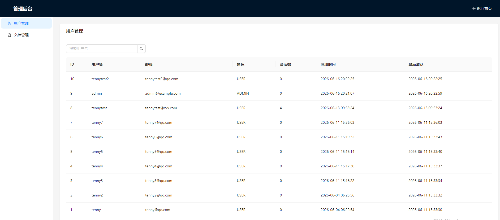
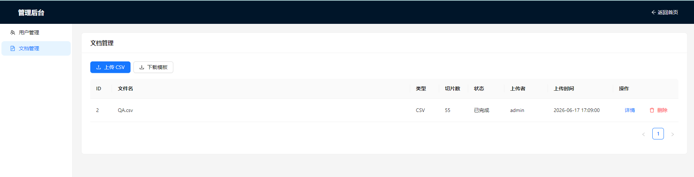
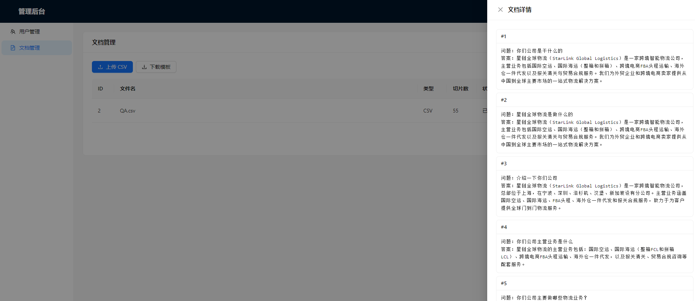
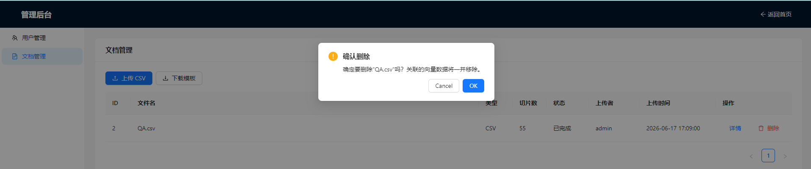

# 第三期：RAG 知识库与后台管理系统

## 前言

上一期我们构建了完整的用户认证系统、多轮对话和会话隔离，AI 已经能记住上下文了。但回答仍然局限在模型的通用知识上——问"你们公司是做什么的"，模型只能泛泛回答，因为它不了解我们的私有业务知识。

本期围绕这个痛点做两件事：

1. **RAG（检索增强生成）** — 将私有的 QA 知识库接入对话系统，让 AI 基于真实业务文档回答问题
2. **后台管理系统** — 区分管理员和普通用户，提供知识库文档管理、用户管理等后台功能

这两个其实是配套的：RAG 的效果取决于知识库的质量，而知识库需要有个地方来管理（上传、查看、删除）。

---

## 什么是 RAG？

RAG（Retrieval-Augmented Generation，检索增强生成）是目前解决 LLM"知识不足"问题的主流方案。它的核心思想很简单：

> **不改变模型本身，而是在提问时，先从知识库中检索出相关片段，作为上下文拼入 Prompt，再让模型回答。**

```
用户提问："你们公司是做什么的？"
                      │
                      ▼
     ┌──────────────────────────────┐
     │   1. 检索（Retrieve）         │
     │   将问题转为向量 → 向量数据库  │
     │   相似度搜索 → 返回 TopK 片段  │
     └──────────────┬───────────────┘
                    │  "星链全球物流是一家跨境智能物流公司..."
                    ▼
     ┌──────────────────────────────┐
     │   2. 增强（Augment）          │
     │   将检索到的片段拼入 Prompt   │
     │   "基于以下知识回答：\n        │
     │    星链全球物流是一家..."     │
     └──────────────┬───────────────┘
                    │
                    ▼
     ┌──────────────────────────────┐
     │   3. 生成（Generation）       │
     │   LLM 基于上下文生成回答      │
     │   "星链全球物流是一家..."     │
     └──────────────────────────────┘
```

**为什么不用微调？**

| 对比 | RAG | 微调 |
|---|---|---|
| 知识更新 | 换文档，立即生效 | 重新训练，数小时~数天 |
| 成本 | 只需 Embedding 一次 | GPU 训练费用 |
| 幻觉控制 | 强（回答基于检索到的原文） | 弱（模型可能"记住"错误） |
| 实现复杂度 | 低（Spring AI 内置支持） | 高（需要训练 pipeline） |

对于这个项目（物流公司 QA 知识库），RAG 是最合适的选择——文档更新频繁、内容结构化、对准确性要求高。

**RAG 的两个关键组件：**

1. **Embedding 模型** — 将文本转为向量。用户提问时，同样转为向量，去向量库中找"意思相近"的片段
2. **向量数据库** — 存储文本向量，提供相似度搜索。本项目使用 Redis Stack（`RedisVectorStore`）

---

## 项目中的 graph 架构

graph骨架更新了，新增RetrieveNode，所以现在Graph 的节点链是：

```
START → RetrieveNode → ChatNode → END
```

### RetrieveNode：检索节点

用户每次提问时，该节点先从向量库中搜索相关文档：

```java
// RetrieveNode.java
public Map<String, Object> apply(OverAllState state) {
    String query = state.value("message", "");
    
    List<Document> docs = vectorStore.similaritySearch(
        SearchRequest.builder()
            .query(query)
            .topK(3)
            .similarityThreshold(0.7)
            .build()
    );
    
    String context = docs.stream()
            .map(Document::getText)
            .collect(Collectors.joining("\n---\n"));
    
    return Map.of("ragContext", context);
}
```

三个参数：
- **`query`** — 用户的原始问题
- **`topK(3)`** — 返回最相似的 3 条文档
- **`similarityThreshold(0.7)`** — 相似度阈值，低于 0.7 的忽略（避免无关内容干扰）

### ChatNode：带上下文的生成

`ChatNode` 拿到 `ragContext` 后，将其拼入 system prompt：

```java
// ChatNode.java
String context = state.value("ragContext", "");
String systemPrompt = "你是一个有用的AI助手。";
if (!context.isEmpty()) {
    systemPrompt += "\n\n以下是相关的知识库内容，请基于这些信息回答：\n" + context;
}
```

这样 LLM 在生成回答时就有了事实依据（知识库中的原文），而不是凭"记忆"作答。

### GraphConfig：串联节点

```java
stateGraph.addNode("RetrieveNode", AsyncNodeAction.node_async(new RetrieveNode(vectorStore)));
stateGraph.addNode("ChatNode", AsyncNodeAction.node_async(new ChatNode(builder)));

stateGraph.addEdge(StateGraph.START, "RetrieveNode");
stateGraph.addEdge("RetrieveNode", "ChatNode");
stateGraph.addEdge("ChatNode", StateGraph.END);
```

流程清晰：提问 → 检索 → 生成 → 返回。

### 向量存储配置

```java
// VectorStoreConfig.java
@Bean
public VectorStore vectorStore(JedisPooled jedisPooled, EmbeddingModel embeddingModel) {
    return RedisVectorStore.builder(jedisPooled, embeddingModel)
            .initializeSchema(true)
            .indexName("ai_agent_rag_index:")
            .prefix("ai_agent_rag_prefix:")
            .build();
}
```

使用 Redis Stack 作为向量数据库，Embedding 模型用的是智谱 AI 的 `embedding-3`。

---

## 问题：知识库的内容从哪里来？

架构搭好了，但还缺最关键的一环——**知识库是空的**。

所以本期要做的其实是两件事的组合：
1. **管理员能上传/管理文档** → 知识库内容来源
2. **RAG 引擎自动检索** → 知识库在对话中的应用
---

## 管理员角色设计

### 数据库字段

在 `user` 表新增一个 `role` 字段：

```sql
ALTER TABLE `user` ADD COLUMN `role` VARCHAR(32) NOT NULL DEFAULT 'USER';
```

Java 枚举：

```java
public enum UserRole {
    USER,
    ADMIN
}
```

User 实体加字段：`private UserRole role;`

### 默认管理员

```sql
INSERT IGNORE INTO `user` (`username`, `email`, `password`, `role`)
VALUES ('admin', 'admin@example.com', '${BCRYPT_HASH}', 'ADMIN');
```

密码 `admin123` 用 `BCryptPasswordEncoder` 加密后写死在 SQL 中，项目启动时人工执行。

### @AdminRequired 注解

新增一个 `@AdminRequired` 注解，用于标记需要管理员权限的接口：

```java
@Target(ElementType.METHOD)
@Retention(RetentionPolicy.RUNTIME)
public @interface AdminRequired {}
```

在 `AuthInterceptor` 中增加角色校验逻辑：

```java
boolean requiresAuth = hm.hasMethodAnnotation(AuthRequired.class);
boolean requiresAdmin = hm.hasMethodAnnotation(AdminRequired.class);

if (!requiresAuth && !requiresAdmin) return true;

// 校验 token（共用逻辑）
String token = TokenUtils.extractToken(request);
String loginResponseStr = redisTemplate.opsForValue().get("token:" + token);
LoginResponse loginResponse = JSON.parseObject(loginResponseStr, LoginResponse.class);
UserContext.setUserId(loginResponse.getId());

// 额外检查 admin role
if (requiresAdmin && !"ADMIN".equals(loginResponse.getRole())) {
    writeForbidden(response);  // 403
    return false;
}
```

`@AdminRequired` 隐含了"已登录"的语义，所以标记了它的方法不需要再写 `@AuthRequired`。

### 前端角色感知

登录时把 role 存到 localStorage：

```javascript
localStorage.setItem('role', loginData.role);
```

首页根据 role 显示"进入管理后台"按钮：

```jsx
{localStorage.getItem('role') === 'ADMIN' && (
  <Button type="link" onClick={() => navigate('/admin')}>
    进入管理后台
  </Button>
)}
```

后台路由受 `AdminRoute` 保护：

```jsx
function AdminRoute({ children }) {
  const token = localStorage.getItem('token');
  const role = localStorage.getItem('role');
  if (!token) return <Navigate to="/login" replace />;
  if (role !== 'ADMIN') return <Navigate to="/" replace />;
  return children;
}
```

---

## 后台管理界面

### 路由设计

```jsx
<Route path="/admin" element={<AdminRoute><AdminLayout /></AdminRoute>}>
  <Route index element={<Navigate to="/admin/users" />} />
  <Route path="users" element={<UserManagement />} />
  <Route path="documents" element={<DocumentManagement />} />
</Route>
```

### AdminLayout

使用 Ant Design 的 Layout + Menu 构建：

```jsx
function AdminLayout() {
  const menuItems = [
    { key: '/admin/users', icon: <TeamOutlined />, label: '用户管理' },
    { key: '/admin/documents', icon: <FileTextOutlined />, label: '文档管理' },
  ];

  return (
    <Layout style={{ minHeight: '100vh' }}>
      <Header>管理后台</Header>
      <Layout>
        <Sider theme="light" width={200}>
          <Menu selectedKeys={[location.pathname]}
                items={menuItems}
                onClick={({ key }) => navigate(key)} />
        </Sider>
        <Content style={{ padding: 24 }}>
          <Outlet />  {/* 子路由在这里渲染 */}
        </Content>
      </Layout>
    </Layout>
  );
}
```

路由嵌套关系一目了然：

```
/admin          → AdminLayout + Navigate → /admin/users
/admin/users    → AdminLayout + UserManagement
/admin/documents → AdminLayout + DocumentManagement
```

---

## 用户管理页面



一个典型的后台表格页，支持分页和用户名搜索：

| 列 | 说明 |
|---|---|
| ID | 用户 ID |
| 用户名 | 支持模糊搜索 |
| 邮箱 | 注册时填写的邮箱 |
| 角色 | USER / ADMIN |
| 会话数 | 通过 `COUNT(*)` 关联查询 |
| 注册时间 | 格式化为 `yyyy-MM-dd HH:mm:ss` |

**后端实现**：

控制器用 POST 接收分页参数：

```java
@PostMapping("/pageList")
@AdminRequired
public ApiResult<Page<UserPageVO>> list(@RequestBody UserPageReq req) {
    return ApiResult.success(userService.getUserPage(req));
}
。

Service 层的实现使用 MyBatis-Plus 的分页和条件查询：

```java
public Page<UserPageVO> getUserPage(UserPageReq req) {
    // 1. 分页查询用户
    LambdaQueryWrapper<User> wrapper = new LambdaQueryWrapper<>();
    wrapper.like(StringUtils.isNotBlank(req.getUsername()), User::getUsername, req.getUsername())
           .orderByDesc(User::getCreatedAt);

    Page<User> userPage = page(new Page<>(req.getPage(), req.getSize()), wrapper);

    // 2. 查每个用户的会话数
    List<Long> userIds = userPage.getRecords().stream().map(User::getId).toList();
    Map<Long, Integer> countMap = conversationMapper.selectMaps(...)
        .stream().collect(Collectors.toMap(m -> (Long) m.get("user_id"), m -> ((Long) m.get("cnt")).intValue()));

    // 3. 组装 VO（含会话数）
    List<UserPageVO> voList = userPage.getRecords().stream().map(user -> {
        UserPageVO vo = new UserPageVO();
        BeanUtils.copyProperties(user, vo);
        vo.setConversationCount(countMap.getOrDefault(user.getId(), 0));
        return vo;
    }).toList();
    ...
}
```

**前端**：Ant Design `<Table>` + `<Input.Search>`，搜索时重置页码为 1。

---

## 文档管理（知识库）

这是本期的核心功能。

### 数据库设计

两张表：

```sql
-- 文档记录（一个上传文件对应一条记录）
CREATE TABLE `document` (
    `id` BIGINT AUTO_INCREMENT PRIMARY KEY,
    `filename` VARCHAR(255) NOT NULL,
    `file_type` VARCHAR(20) DEFAULT 'CSV',
    `chunk_count` INT DEFAULT 0,        -- 导入到向量库的切片数
    `status` VARCHAR(20) DEFAULT 'COMPLETED',  -- IMPORTING / COMPLETED / FAILED
    `uploaded_by` BIGINT,
    `created_at` DATETIME,
    `updated_at` DATETIME
);

-- 文档切片记录（文件里的每一行/每一段）
CREATE TABLE `document_chunk` (
    `id` BIGINT AUTO_INCREMENT PRIMARY KEY,
    `document_id` BIGINT NOT NULL,
    `vector_id` VARCHAR(128) NOT NULL,   -- Redis 向量库中的 Document ID
    `content` TEXT,                      -- 切片内容（QA 对）
    `chunk_index` INT,                   -- 序号
    `created_at` DATETIME DEFAULT CURRENT_TIMESTAMP
);
```

为什么需要 `document_chunk` 表？因为 `vectorStore.delete()` 需要按 `documentId` 删除 Redis 中的向量，不记录 vector_id 就无法精确删除。

### 上传流程

```
用户上传 CSV 文件
           │
           ▼
  1. 保存 document 记录（status=IMPORTING）
           │
           ▼
  2. 解析 CSV，每一行生成一个 Document 对象
     设置 vectorId = UUID.randomUUID()
           │
           ▼
  3. vectorStore.add(documents)     → 写入 Redis 向量库
           │
           ▼
  4. 保存所有 document_chunk 记录   → 写入 MySQL
     更新 document 状态为 COMPLETED
```

**关键点**：

1. **状态管理** — 三态：`IMPORTING` → `COMPLETED` / `FAILED`。如果中间任何一步失败，状态标记为 `FAILED`，管理员可以在列表里看到异常记录
2. **自控 vectorId** — 在调用 `vectorStore.add()` 之前就生成好 UUID 并设置到 `Document.id`，这样 Redis 中的 ID 和 MySQL 中的记录一致，删除时能精确匹配
3. **事务边界** — Redis 操作无法参与 MySQL 事务，所以设计上允许"MySQL 失败但 Redis 已有数据"的情况（状态为 FAILED）。严谨的作法是 catch 异常后主动 `vectorStore.delete()` 回滚，但当前已够用

```java
public void upload(MultipartFile file) {
    // 1. 保存 IMPORTING 状态
    Document documentEntity = new Document();
    documentEntity.setStatus(DocumentStatus.IMPORTING.name());
    this.save(documentEntity);

    List<org.springframework.ai.document.Document> vectorDocs;
    try {
        vectorDocs = this.parseCsv(file);  // 生成 vectorId
    } catch (IOException e) {
        documentEntity.setStatus(DocumentStatus.FAILED.name());
        this.updateById(documentEntity);
        throw new BusinessException("文件解析失败: " + e.getMessage());
    }

    // 2. 写入 Redis 向量库
    vectorStore.add(vectorDocs);

    // 3. 保存 chunk 记录 + 更新状态为 COMPLETED
    List<DocumentChunk> chunks = vectorDocs.stream().map(doc -> {
        DocumentChunk chunk = new DocumentChunk();
        chunk.setDocumentId(documentEntity.getId());
        chunk.setVectorId(doc.getId());
        chunk.setContent(doc.getText());
        return chunk;
    }).toList();
    documentChunkService.saveBatch(chunks);

    documentEntity.setChunkCount(vectorDocs.size());
    documentEntity.setStatus(DocumentStatus.COMPLETED.name());
    this.updateById(documentEntity);
}
```

### 删除流程

```
点击删除 → Modal 确认
           │
           ▼
  1. 从 document_chunk 查出所有 vector_id
           │
           ▼
  2. vectorStore.delete(vectorIds)   → 从 Redis 移除向量
           │
           ▼
  3. 删除 document_chunk 记录
  4. 删除 document 记录
```

```java
public void delete(Long id) {
    List<DocumentChunk> chunks = documentChunkService.lambdaQuery()
            .eq(DocumentChunk::getDocumentId, id).list();

    List<String> vectorIds = chunks.stream()
            .map(DocumentChunk::getVectorId).toList();

    vectorStore.delete(vectorIds);                           // 清 Redis
    documentChunkService.removeByIds(chunks.stream().map(DocumentChunk::getId).toList()); // 清 MySQL chunk
    this.removeById(id);                                     // 清 MySQL document
}
```

### 模板下载

提供一个 CSV 模板供管理员下载，确保上传格式正确：

```csv
问题,答案
示例问题1,示例答案1
示例问题2,示例答案2
```

### 文档详情查看

点击列表中的"详情"按钮，展示所有切片内容。

每个 QA 对作为一个 Card，显示序号和内容。管理员可以直观地看到知识库里有哪些数据，方便排查问题。

### 文件重复校验

上传时按文件名查重，避免无意中导入重复数据：

```java
long exists = lambdaQuery()
    .eq(Document::getFilename, file.getOriginalFilename())
    .count();
if (exists > 0) {
    throw new BusinessException("文件已存在，请先删除旧文件再上传");
}
```

---

## 前后端整体架构

经过三期迭代，项目的完整架构如下：

```
前端（React 19 + Ant Design 6）
├── 登录 / 注册页面
├── 聊天页面（SSE 流式 + 会话管理）
└── 管理后台
    ├── 用户管理（分页列表 + 搜索）
    └── 文档管理（上传 / 列表 / 详情 / 删除）
              │          ▲
              │ HTTP API │
              ▼          │
后端（Spring Boot 3.5 + Spring AI 1.1.2）
├── /api/auth/*       认证接口
├── /api/conversation/* 聊天 + 会话管理
├── /api/admin/user/*   用户管理
├── /api/admin/document/* 文档管理
│
├── Graph 引擎
│   ├── RetrieveNode → 向量检索
│   └── ChatNode → LLM 生成（带 RAG 上下文）
│
└── 数据层
    ├── MySQL（user / conversation / document / document_chunk）
    ├── Redis（Token 缓存 + Graph 状态 + 向量存储）
    └── 智谱 AI API（LLM + Embedding）
```

---

## 效果展示








---

## 踩坑记录

1. **`@Transactional` 让状态管理失效** — 上传方法加了 `@Transactional` 后，捕获异常设 FAILED 时整个事务回滚，FAILED 状态根本写不进去。解决：去掉 `@Transactional`，让每个 MySQL 操作各自原子提交

2. **前端的 baseURL 不匹配** — 前端 `client.js` 统一设了 `baseURL: /api`，而 admin 接口的 `@RequestMapping("/admin/...")` 拼出来是 `/api/admin/...` 才对。解决：后端 Controller 统一加 `/api` 前缀

3. **`spring.jackson.date-format` 对 LocalDateTime 无效** — yaml 配置全局日期格式不生效，因为 `LocalDateTime` 由 `JavaTimeModule` 序列化，不读这个配置。解决：在实体字段上加 `@JsonFormat(pattern = "yyyy-MM-dd HH:mm:ss")`

4. **全局异常处理器返回的 HTTP 状态码问题** — 用 `@ExceptionHandler` 返回 `ApiResult` 时默认是 200，前端 Axios 走进 `.then` 而不是 `.catch`。解决：前端统一判断 `res.code === 0` 来处理业务错误

---

## 下期预告

第四期将引入 **网络搜索能力**——让 AI 的回答覆盖实时信息。

第三期完整代码已提交至 GitHub，欢迎 star 和讨论。
