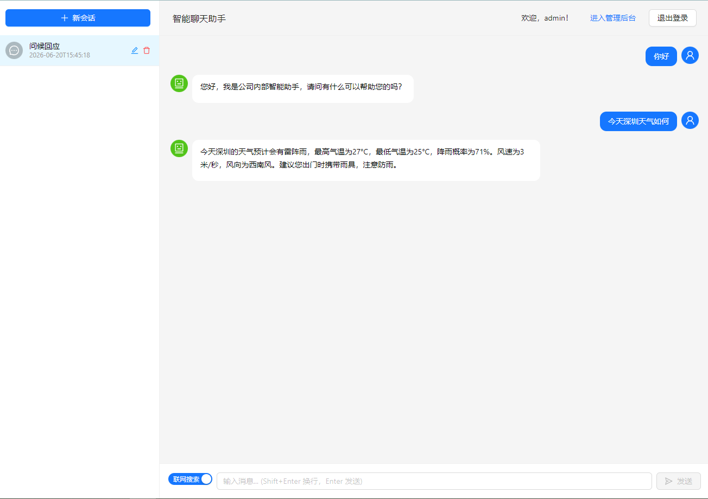
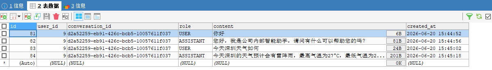

# 第四期：联网搜索工具实现

## 前言

第三期我们完成了 RAG 知识库和后台管理系统，AI 已经能基于公司私有知识回答业务问题了。但有几个明显的问题：

1. **知识是静态的** — 知识库中的 QA 是预先上传的，AI 不知道最新信息（如实时天气、新闻）
2. **消息不可靠** — 依赖 Redis checkpoint 存储聊天记录，偶尔丢消息
3. **前端体验细节** — 无会话时需手动点击"新会话"、刷新后搜索开关重置、输入框焦点丢失等

本期针对这些问题做改造：

1. **联网搜索** — 引入 Tavily 搜索 API，让 AI 在有需要时自主搜索互联网
2. **消息持久化重构** — 从 Redis checkpoint 迁移到 MySQL，彻底解决历史消息丢失
3. **若干前端细节优化** — 自动创建会话、搜索状态持久化、光标自动聚焦等

---

## 1. 联网搜索功能

### 技术选型

选择 **Tavily Search API** 作为搜索源，原因是：
- 专门为 AI Agent 设计，返回结构化 JSON（标题、摘要、内容），不需要自行解析 HTML
- 支持 `include_answer: true`，自动生成 AI 摘要
- REST API，通过 `RestTemplate` 调用即可，不引入额外依赖

### WebSearchTool 实现

```java
@Component
public class WebSearchTool {

    private final RestTemplate restTemplate;
    private final ObjectMapper objectMapper;

    @Value("${tavily.api-key}")
    private String apiKey;

    @Value("${tavily.endpoint}")
    private String endpoint;

    @Tool(description = "搜索互联网获取最新信息，适用于实时信息、新闻、当前事件、知识查询等场景")
    public String webSearch(@ToolParam(description = "搜索关键词") String query) {
        TavilyRequest request = new TavilyRequest();
        request.setApiKey(apiKey);
        request.setQuery(query);
        request.setSearchDepth("basic");
        request.setIncludeAnswer(true);
        request.setMaxResults(5);

        String response = restTemplate.postForObject(endpoint, request, String.class);
        TavilyResponse tavilyResponse = objectMapper.readValue(response, TavilyResponse.class);

        StringBuilder result = new StringBuilder();
        if (tavilyResponse.getAnswer() != null) {
            result.append("摘要：").append(tavilyResponse.getAnswer()).append("\n\n");
        }
        for (int i = 0; i < tavilyResponse.getResults().size(); i++) {
            TavilyResult r = tavilyResponse.getResults().get(i);
            result.append(i + 1).append(". ").append(r.getTitle()).append("\n");
            result.append("   内容：").append(r.getContent()).append("\n\n");
        }
        return result.toString();
    }
}
```

### @Tool 的透明调用机制

这是 Spring AI 中**最关键的认知**——`@Tool` 的调用对开发者是透明的：

```
UserMessage("今天深圳天气如何？")
    │
    ▼
  模型收到请求，发现需要实时信息
    │
    ▼
  模型返回 ToolCall(tool=webSearch, args="深圳天气")
    │
    ▼
  Spring AI 自动执行 webSearchTool.webSearch("深圳天气")
    │
    ▼
  模型收到 ToolCallResult("今天深圳雷阵雨，25-31°C...")
    │
    ▼
  模型生成 AssistantMessage("今天深圳雷阵雨，25-31°C...")
    │
    ▼
  stream().content() 吐出最终文字 token（工具调用过程对开发者完全隐藏）
```

这意味着：
- 开发者**只需要注册 tool**，调用链由框架自动完成
- `stream().content()` 只吐出文字 token，**不会吐出 ToolCall / ToolCallResult 中间过程**
- 前端 SSE 收到的仍然是完整文字，**不需要任何改动**

### 前端联网搜索开关

加入了"联网搜索"开关，状态持久化到 `localStorage`：

```jsx
const [webSearchEnabled, setWebSearchEnabled] = useState(() => {
  return localStorage.getItem('webSearchEnabled') === 'true';
});

const handleWebSearchChange = (checked) => {
  setWebSearchEnabled(checked);
  localStorage.setItem('webSearchEnabled', checked);
};
```

刷新页面后状态保持，和 DeepSeek 的体验一致。

### 架构设计：为什么只用 @Tool 不走 MCP？

本期的联网搜索直接使用 `@Tool` 在 app 模块中实现，原因是：
- **仅一个工具**，单独启动一个 MCP Server 成本高于收益
- **搜索逻辑简单**，就是调一个 REST API，不需要独立服务

后续如果接入查快递单号这类需要独立服务的功能，再改造成 MCP 模式。

---

## 2. 消息持久化：从 Redis Checkpoint 到 MySQL

### 问题：第三期留下的坑

第三期的多轮对话依赖 `saveConversationState()` 在 `doFinally` 中异步写入 Redis checkpoint：

```java
.doFinally(signalType -> {
    saveConversationState(conversationId, fullResponse.toString());
});
```

但这个机制有两个严重问题：

1. **时序问题** — `doFinally` 触发时，checkpoint 可能还没写入 Redis，`compiledGraph.getState()` 抛出 `Missing Checkpoint!`
2. **Flux 无法序列化** — `ChatNode` 返回的 state 中包含 `assistant: Flux<String>`，RedisSaver 无法正常序列化，导致 checkpoint 写入失败
3. **消息丢失** — 异常被 catch 吞掉，AI 回复永远存不进去。刷新页面后最多只显示用户消息，AI 回复全没了

### 解决方案：MySQL 独立存储

新增 `message` 表，把消息存储的职责从 Graph checkpoint 解耦出来：

```sql
CREATE TABLE message (
    id BIGINT PRIMARY KEY AUTO_INCREMENT,
    user_id BIGINT NOT NULL,
    conversation_id VARCHAR(36) NOT NULL,
    role VARCHAR(10) NOT NULL,
    content TEXT NOT NULL,
    created_at DATETIME NOT NULL,
    INDEX idx_conversation_id (conversation_id)
);
```

写入流程改为先存用户消息，再流式回复，最后存 AI 回复：

```java
// 1. 流开始前：立即存用户消息
Message userMsg = new Message();
userMsg.setConversationId(conversationId);
userMsg.setUserId(userId);
userMsg.setRole("USER");
userMsg.setContent(req.getMessage());
userMsg.setCreatedAt(LocalDateTime.now());
messageMapper.insert(userMsg);

// 2. 流式调用
return compiledGraph.stream(initialState, config)
    .ofType(StreamingOutput.class)
    .map(...)
    .doFinally(signalType -> {
        // 3. 流结束后：存 AI 回复
        Message assistantMsg = new Message();
        assistantMsg.setConversationId(conversationId);
        assistantMsg.setUserId(userId);
        assistantMsg.setRole("ASSISTANT");
        assistantMsg.setContent(fullResponse.toString());
        assistantMsg.setCreatedAt(LocalDateTime.now());
        messageMapper.insert(assistantMsg);
    });
```

这样用户消息零丢失，即使 SSE 断连，用户消息已经落库。

### 历史消息加载

每次 `stream()` 之前，从 MySQL 加载历史消息，转换为 Spring AI 的 `Message` 类型传入 initialState：

```java
// 加载历史消息
List<Message> dbMessages = messageMapper.selectList(
    new LambdaQueryWrapper<Message>()
        .eq(Message::getConversationId, conversationId)
        .orderByAsc(Message::getCreatedAt)
);

// 转为 Spring AI Message 列表
List<org.springframework.ai.chat.messages.Message> historyMessages = dbMessages.stream()
    .map(msg -> {
        if ("USER".equals(msg.getRole())) {
            return new UserMessage(msg.getContent());
        } else {
            return new AssistantMessage(msg.getContent());
        }
    })
    .collect(Collectors.toList());

Map<String, Object> initialState = new HashMap<>();
initialState.put("message", req.getMessage());
initialState.put("messages", historyMessages);
initialState.put("webSearchEnabled", ...);

return compiledGraph.stream(initialState, config)...;
```

`ChatNode` 拿到的 `state.value("messages")` 就是完整的对话历史，不再依赖 checkpoint。

### 删除会话时清理 Redis

Redis 中有三个关联 key：

```
graph:thread:meta:{conversationId}           ← 元数据
graph:checkpoint:content:{checkpointUuid}    ← 内容
graph:thread:reverse:{checkpointUuid}        ← 反向索引
```

checkpoint UUID 存在 meta key 的 `thread_id` 字段中：

```java
String metaKey = "graph:thread:meta:" + conversationId;
RMap<String, String> meta = redissonClient.getMap(metaKey);
String checkpointId = meta.get("thread_id");

if (checkpointId != null) {
    redissonClient.getKeys().delete(
        "graph:checkpoint:content:" + checkpointId,
        "graph:thread:reverse:" + checkpointId
    );
}
redissonClient.getKeys().delete(metaKey);
```

---

## 3. 前端细节优化

### SSE 从 GET 改为 POST

随着参数增多（`message` + `conversationId` + `webSearchEnabled`），GET 请求显得臃肿，改为 POST + JSON body：

```jsx
const response = await fetch(`${baseURL}/conversation/chat`, {
  method: 'POST',
  headers: {
    'Authorization': `Bearer ${token}`,
    'Content-Type': 'application/json',
    'Accept': 'text/event-stream'
  },
  body: JSON.stringify({
    message: query,
    conversationId: conversationId,
    webSearchEnabled: webSearchEnabled
  })
});
```

SSE 响应仍然是 `text/event-stream`，`response.body.getReader()` 的逻辑完全不变。

### 无会话时自动创建

参照 DeepSeek 的行为：

```jsx
const createTempSession = () => {
  const tempId = `temp_${Date.now()}_${Math.random().toString(36).substr(2, 6)}`;
  const tempSession = {
    conversationId: tempId,
    title: '新对话',
    isTemp: true
  };
  setSessions(prev => [tempSession, ...prev]);
  setCurrentSessionId(tempId);
  return tempId;
};

const handleSendMessage = async (content) => {
  let targetId = currentSessionId;
  if (!targetId) {
    targetId = createTempSession();
  }
  // ... 发送逻辑
};
```

### AI 回复完成后自动聚焦输入框

流式回复结束后，`loading` 变为 `false`，但焦点没有回到输入框，用户需要手动点击才能继续输入。使用 `useEffect` 监听 `loading` 状态变化实现自动聚焦：

```jsx
import { useRef, useEffect } from 'react';

function MessageInput({ onSend, loading, webSearchEnabled, onWebSearchChange }) {
  const textAreaRef = useRef(null);

  useEffect(() => {
    if (!loading) {
      textAreaRef.current?.focus();
    }
  }, [loading]);

  return (
    <TextArea ref={textAreaRef} ... />
  );
}
```

### 头像不被撑开

长回答时 AI 头像图标被 flex 布局压扁，加上 `flexShrink: 0` 解决：

```jsx
<Avatar 
  icon={<RobotOutlined />} 
  style={{ marginRight: '8px', background: '#52c41a', flexShrink: 0 }}
/>
```

同时主内容区加 `minWidth: 0`，`pre > code` 加 `word-break: break-word; white-space: pre-wrap`，防止长代码块撑破容器。

### 日志降噪

Graph 引擎的 `NodeExecutor` 每收到一个 token 就打印一行 INFO 日志：

```yaml
logging:
  level:
    com.alibaba.cloud.ai.graph.executor.NodeExecutor: WARN
```

---

## 4. 架构演化回顾

经过四期迭代，项目的架构已经变得清晰：

```
前端（React 19 + Ant Design 6）
├── 登录 / 注册页面
├── 聊天页面（SSE 流式 + 会话管理 + 联网搜索开关）
└── 管理后台（用户管理 + 文档管理）

后端（Spring Boot 3.5 + StateGraph）
├── 认证系统（Token + Redis + ThreadLocal）
├── Graph 编排
│   ├── RetrieveNode（强制检索向量知识库）
│   └── ChatNode（条件注册 webSearchTool）
├── RAG 检索（RetrieveNode → VectorStore → Redis Stack）
├── 联网搜索工具（WebSearchTool → Tavily API）
└── 消息存储（MySQL message 表）
```

各期关键词：

| 期 | 主题 | 核心引入 |
|---|---|---|
| 第一期 | 项目开篇与流式聊天 | StateGraph、SSE streaming |
| 第二期 | 用户认证、多轮对话、会话隔离 | Auth、RedisSaver、threadId |
| 第三期 | RAG 知识库与后台管理 | RetrieveNode、VectorStore、Admin |
| **第四期** | **联网搜索与架构演进** | **@Tool 联网搜索、MySQL 消息存储、前端体验优化** |

---

## 效果展示





---

## 踩坑记录

1. **AI 提及工具** — 模型会在回答中说"我调用了工具来获取..."，需要在 system prompt 中明确禁止
2. **Missing Checkpoint 异常** — `doFinally` 中调用 `compiledGraph.getState()` 时序不可靠，改为 MySQL 独立存储消息，彻底解决
3. **头像被压扁** — flex 布局中头像默认 `flex-shrink: 1`，长回答时会压缩图标，加 `flexShrink: 0` 解决
4. **Redis checkpoint 残留** — 删除会话后 Redis 中的 graph checkpoint key 不会自动清理，需要手动从 meta key 中提取 checkpoint UUID 后逐一删除
5. **流结束后输入框失去焦点** — 流式回复完成后需要用户手动点击输入框才能继续输入，使用 `useRef` + `useEffect` 监听 `loading` 状态自动聚焦

---

## 下期预告

第五期计划引入 **MCP（Model Context Protocol）**——将独立服务（如查快递单号）通过 MCP Server 接入，体验真正的工具服务化架构。

项目完整代码已上传至 GitHub：[tenny-peng/spring-ai-agent-demo](https://github.com/tenny-peng/spring-ai-agent-demo)
