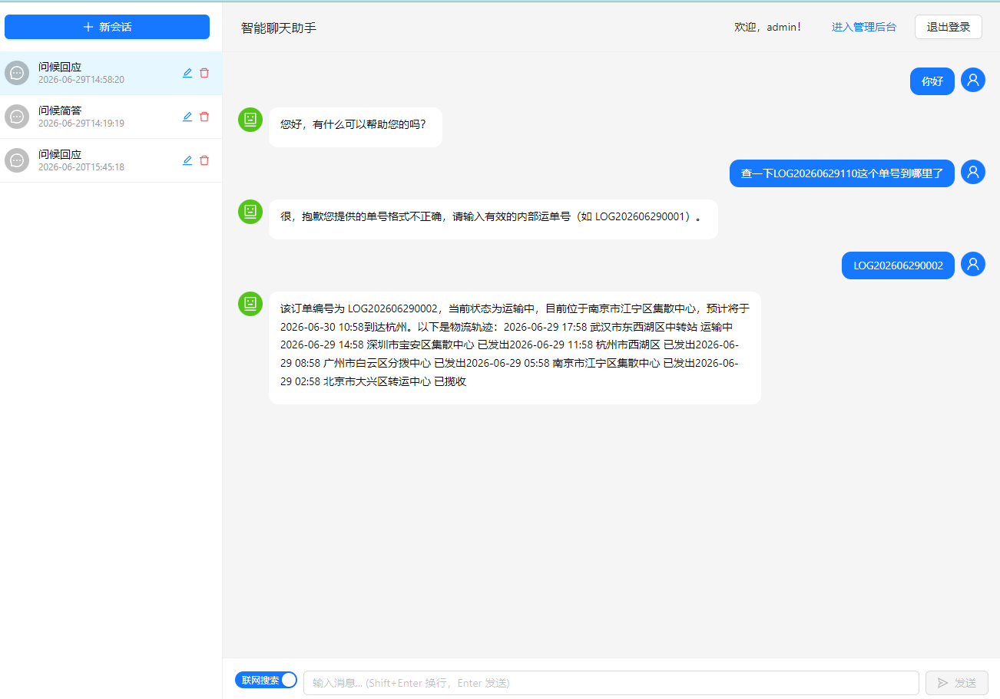

# 第五期：MCP 物流查询服务

## 前言

第四期我们完成了联网搜索功能，AI 已经能通过 `@Tool` 调用外部 API 获取实时信息。但工具是以 `@Component` 的形式直接写在 app 模块中的——搜索逻辑简单，这样没问题。

但随着业务变复杂，这种"工具写在主应用里"的方式开始暴露问题：

1. **耦合** — 工具逻辑和 AI 应用在同一进程中，改一个工具要重启整个应用
2. **不通用** — 如果另一个系统（比如运营后台的 AI 助手）也需要查物流，只能再写一遍
3. **非标准** — 每个工具的调用方式不同，没有统一的发现和调用协议

本期引入 **MCP（Model Context Protocol）** 来解决这些问题，以一个**物流查询**场景作为实战案例。

---

## 什么是 MCP？

MCP 是 Anthropic 提出的一种开放协议，定义了 AI 应用与外部工具/数据源之间的标准化交互方式。

用一句话概括：**MCP 之于 AI 工具，就像 USB 之于外设。**

```
传统方式（@Tool 直接注入）           MCP 方式
                                  │
┌──────────┐    ┌──────────┐     ┌──────────┐    ┌──────────────┐
│ AI 应用  │───→│ 搜索工具  │     │ AI 应用  │──SSE→│ MCP Server   │
│ (app)    │    │ (本地)    │     │ (app)    │     │ (物流服务)    │
└──────────┘    └──────────┘     └──────────┘     └──────┬───────┘
                                                         │ Feign/HTTP
                                                         ▼
                                                    ┌──────────────┐
                                                    │ 物流业务服务  │
                                                    │ (已有系统)    │
                                                    └──────────────┘
```

MCP 的核心特点：
- **标准化接口** — 所有工具通过统一的 SSE 或 stdio 协议暴露
- **服务自治** — 工具独立部署、独立升级，不影响主应用
- **语言无关** — MCP Server 可以用任何语言开发
- **自动发现** — 客户端连接后自动获取工具列表和 schema

---

## 整体架构

本期新增了一个模块：`app-mcp-logistics-server`，一个独立的 MCP Server。

```
用户
  │
  ▼
app (8080) ──MCP Client(SSE)──→ app-mcp-logistics-server (8888)
  │                                    │
  │ 条件注入                             │ LogisticsTool.queryLogistics()
  │ @Tool(webSearch)                     │ 模拟物流数据
  │                                    │
  ▼                                    ▼
Tavily API                           (物流业务系统 - 占位)
```

**分层关系：**
- **`app`** — AI 助手主应用，既是 MCP 客户端（消费 MCP Server），也是 Tavily API 的直接调用者
- **`app-mcp-logistics-server`** — 物流查询 MCP Server，将物流查询能力包装为 MCP Tool
- **工具分工** — 联网搜索（直接 `@Tool`）由 AI 按需决定是否启用；物流查询（MCP Tool）始终可用

---

## 项目结构变化

### 新增模块

```
app-mcp-logistics-server/
├── pom.xml
└── src/main/
    ├── java/com/tenny/
    │   ├── McpLogisticsServerApplication.java    # 启动类
    │   ├── config/McpConfig.java                 # 注册 LogisticsTool
    │   └── tool/LogisticsTool.java               # 物流查询 @Tool
    └── resources/application.yml                 # 端口 8888
```

### app 模块改动

| 文件 | 改动 |
|------|------|
| `pom.xml` | 新增 `spring-ai-starter-mcp-client-webflux` |
| `application.yml` | 新增 MCP 客户端 SSE 连接配置 |
| `GraphConfig.java` | 注入 `ToolCallbackProvider` |
| `ChatNode.java` | 添加 `toolCallbacks()` 注册 MCP 工具 |

### 父 POM 改动

添加子模块声明：`<module>app-mcp-logistics-server</module>`

---

## MCP Server 端实现

### 依赖

```xml
<dependency>
    <groupId>org.springframework.ai</groupId>
    <artifactId>spring-ai-starter-mcp-server-webflux</artifactId>
</dependency>
```

这个 starter 会自动配置一个 SSE 端点，将注册的 `ToolCallbackProvider` 暴露给 MCP 客户端。

### LogisticsTool

物流查询工具只接受一个参数——**内部运单号**。因为这是公司内部物流场景，用户输入的就是公司内部的单号。

```java
@Component
public class LogisticsTool {

    @Tool(description = "查询内部物流单号的轨迹信息，支持以 LOG 开头后跟 12 位数字的内部运单号")
    public String queryLogistics(
            @ToolParam(description = "内部物流运单号，格式为 LOG + 12 位数字，如 LOG202606290001")
            String trackingNumber) {

        // ================================================================
        // 真实场景：这里通过 Feign / RestTemplate / WebClient 调用物流业务服务
        //   LogisticsResp resp = logisticsFeignClient.query(trackingNumber);
        //   return formatResult(resp);
        // ================================================================

        // 校验内部单号格式
        if (trackingNumber == null || !trackingNumber.matches("LOG\\d{12}")) {
            return "❌ 单号格式不正确，请输入有效的内部运单号（如 LOG202606290001）";
        }

        Random random = new Random(trackingNumber.hashCode());
        // ... 根据 hash 生成模拟轨迹 ...
    }
}
```

**设计要点：**

1. **单参数设计** — 既然是内部查单，用户只需输入单号，不需要快递公司编码
2. **格式校验** — 单号必须匹配 `LOG` + 12 位数字格式，不合法时返回清晰提示，引导 AI 重新提问
3. **真实场景注释** — 代码中保留了注释，展示生产环境中应通过 Feign 或 HTTP 调用物流业务服务
4. **确定性模拟** — 基于 `trackingNumber.hashCode()` 生成种子，同一单号每次查询结果一致

工具的返回格式如下：

```
📦 物流查询结果
运单编号：LOG202606290001
当前状态：运输中
当前位置：上海市浦东新区转运中心
预计到达：2026-06-30 14:30 (杭州)

--- 物流轨迹 ---
2026-06-29 16:00  南京市江宁区集散中心  已发出
2026-06-29 10:00  深圳市宝安区集散中心  已到达
2026-06-29 06:00  广州市白云区分拨中心  已揽收
```

模拟三种状态：已签收（20%）、运输中（50%）、已揽收（30%），每种状态有不同的时间线和位置变化。

### 注册工具

```java
@Configuration
public class McpConfig {

    @Bean
    public ToolCallbackProvider getToolCallbackProvider(LogisticsTool logisticsTool) {
        return MethodToolCallbackProvider.builder().toolObjects(logisticsTool).build();
    }
}
```

`MethodToolCallbackProvider` 将 `LogisticsTool` 中的 `@Tool` 注解方法扫描出来，封装为 MCP 协议可识别的工具调用描述。

### 启动配置

```yaml
server:
  port: 8888
```

MCP Server 是一个独立的 Spring Boot 应用，启动后通过 SSE 协议在 `8888` 端口等待客户端连接。

---

## MCP 客户端集成

### 依赖添加

```xml
<dependency>
    <groupId>org.springframework.ai</groupId>
    <artifactId>spring-ai-starter-mcp-client-webflux</artifactId>
</dependency>
```

### 配置文件

```yaml
spring:
  ai:
    mcp:
      client:
        sse:
          connections:
            logistics-server:
              url: http://localhost:8888
```

应用启动时，自动配置会解析这段配置，创建一个 SSE MCP 客户端连接到 `app-mcp-logistics-server`，自动发现其暴露的工具。

### Graph 集成

```java
// GraphConfig.java
private final WebSearchTool webSearchTool;
private final ToolCallbackProvider toolCallbackProvider;  // 新增

@Bean("chatbotGraph")
public CompiledGraph chatbotGraph(ChatClient.Builder builder) {
    // ...
    stateGraph.addNode("ChatNode",
        AsyncNodeAction.node_async(new ChatNode(builder, webSearchTool, toolCallbackProvider)));
    // ...
}
```

### ChatNode 中的工具注册

```java
// ChatNode.java
var promptBuilder = chatClient.prompt()
        .system(systemPrompt)
        .toolCallbacks(toolCallbackProvider.getToolCallbacks())  // MCP 工具：始终可用
        .messages(historyMessages);

if (Boolean.TRUE.equals(webSearchEnabled)) {
    promptBuilder.tools(webSearchTool);  // 联网搜索：按需启用
}
```

**关键区别：**

| 注册方式 | 工具 | 是否始终可用 | 实现方式 |
|---------|------|------------|---------|
| `toolCallbacks()` | MCP 物流查询 | ✅ 始终可用 | AI 自行判断是否调用 |
| `tools()` | 联网搜索 | ❌ 需要用户开关 | 前端开关控制 |

MCP 工具通过 `toolCallbacks()` 注册，联网搜索通过 `tools()` 注册。前者让 AI 自主决定是否使用，后者需要用户手动开关。

---

## MCP 工具调用流程

当用户输入"帮我查一下单号 LOG202606290001 到哪了"时，整个调用链路如下：

```
用户输入 → POST /api/conversation/chat
    │
    ▼
Graph 引擎 stream()
    │
    ├─ RetrieveNode（强制检索 RAG 知识库）
    │
    └─ ChatNode（LLM 生成 + 工具调用）
          │
          ├─ 模型分析：需要查物流
          │
          ├─ 返回 ToolCall(tool="queryLogistics", args="LOG202606290001")
          │
          ├─ Spring AI 自动执行 MCP Tool
          │     │
          │     ├─ MCP Client 发送请求到 app-mcp-logistics-server:8888
          │     ├─ LogisticsTool.queryLogistics("LOG202606290001")
          │     │     └─ 这里本该调物流业务系统，现在返回模拟数据
          │     └─ 结果返回给模型
          │
          └─ 模型生成 AssistantMessage
                │
                ▼
          stream().content() 逐 token SSE 推送给前端
```

**整个调用过程对开发者完全透明**——写代码的人和用 API 的人都感受不到中间的工具调用过程，前端仍然是逐 token 展示，和普通对话完全一样。

---

## 前端 Bug 修复

在实现本期功能的过程中，发现了一个遗留的前端 Bug。

### 问题

发送一条消息后，再切换会话（点击左侧会话列表中的其他会话），页面没有反应，后端也没有请求发出。但刷新页面后一切正常。

### 排查

经过代码分析，问题出在 `isStreaming` 状态变量上：

```jsx
const [isStreaming, setIsStreaming] = useState(false);

const sendMessageWithSSE = async (...) => {
    setIsStreaming(true);   // ← 只在流开始时设置
    try {
        // ... 流式读取逻辑 ...
    } catch (error) {
        throw error;
    }
    // ← 缺少 setIsStreaming(false)
};
```

`setIsStreaming(true)` 在流开始时执行，但流结束后从未设回 `false`。这导致了一个副作用——切换会话的 `useEffect` 中有一行守卫代码：

```jsx
useEffect(() => {
    if (!currentSessionId) return;
    if (isStreaming) return;   // ← 永远为 true，永远提前返回
    // ... 加载历史消息 ...
}, [currentSessionId]);
```

第一次发送消息后 `isStreaming` 永久变为 `true`，之后切换会话时 `useEffect` 永远提前返回，不加载历史消息。

刷新页面后 `useState` 重新初始化为 `false`，所以表现正常。

### 修复

在 `sendMessageWithSSE` 的 `try...catch` 后加 `finally` 块，无论成功失败都将状态重置：

```jsx
const sendMessageWithSSE = async (...) => {
    setIsStreaming(true);
    try {
        // ... 流式读取逻辑 ...
    } catch (error) {
        console.error('SSE 错误:', error);
        throw error;
    } finally {
        setIsStreaming(false);   // ← 流结束后无论如何都重置
    }
};
```

这是一个典型的状态未重置 Bug，原因是在异步流程中遗漏了清理动作。

---

## 架构回顾

经过五期迭代，项目的完整架构如下：

```
前端（React 19 + Ant Design 6）
├── 登录 / 注册页面
├── 聊天页面（SSE 流式 + 会话管理 + 联网搜索开关 + 自动聚焦）
└── 管理后台（用户管理 + 文档管理）

后端（Spring Boot 3.5 + StateGraph）
├── 认证系统（Token + Redis + ThreadLocal）
├── Graph 编排
│   ├── RetrieveNode（强制检索向量知识库）
│   └── ChatNode（MCP 工具常驻 + 联网搜索按需注入）
├── RAG 检索（RetrieveNode → VectorStore → Redis Stack）
├── 联网搜索工具（WebSearchTool → Tavily API）
├── MCP 客户端 → app-mcp-logistics-server
└── 消息存储（MySQL message 表）

外部服务
├── 智谱 AI API（LLM glm-4-flash + Embedding embedding-3）
├── Tavily Search API（联网搜索）
├── MCP Server（app-mcp-logistics-server:8888）
│   └── LogisticsTool（物流查询）
└── ... 更多 MCP Server 可扩展
```

各期路线图：

| 期 | 主题             | 核心引入 |
|---|----------------|---|
| 第一期 | 项目开篇与流式聊天      | StateGraph、SSE streaming |
| 第二期 | 用户认证、多轮对话、会话隔离 | Auth、RedisSaver、threadId |
| 第三期 | RAG 知识库与后台管理   | RetrieveNode、VectorStore、Admin |
| 第四期 | 联网搜索工具实现       | @Tool、MySQL 消息存储、前端优化 |
| **第五期** | **MCP 物流查询服务** | **MCP Server/Client、工具服务化、前端 Bug 修复** |

---

## MCP vs 直接 @Tool：如何选择

通过本期的实践，可以总结出两种方式的适用场景：

### 直接 @Tool（app 模块内）

```java
@Tool
public String webSearch(String query) { ... }
```

**适合场景：**
- 工具逻辑简单，就是一个 API 调用
- 只在当前应用中使用
- 不需要独立部署和升级

### MCP 方式（独立服务）

```java
// MCP Server 中
@Tool
public String queryLogistics(String trackingNumber) { ... }
```

**适合场景：**
- 工具背后有复杂的业务逻辑（如物流查询需要调多个内部系统）
- 需要被多个应用共享
- 工具需要独立演进和部署
- 团队间服务解耦

**一句话决策：如果这个工具"可能被其他系统调用"，就用 MCP。**

---

## 效果展示



---

## 踩坑记录

1. **`ToolCallbackProvider` 找不到 Bean** — 刚配置好 MCP 客户端时启动报错，检查后发现是 `app-mcp-logistics-server` 没启动，MCP 客户端自动配置无法连接导致 Bean 创建失败。MCP Client 在 Spring AI 中依赖 WebFlux，应用需要确保 WebFlux 依赖完整或服务端已启动

2. **`isStreaming` 状态未重置** — 前端 `sendMessageWithSSE` 中 `setIsStreaming(true)` 后没有对应的重置逻辑，导致切换会话失效。根源是在异步流程中遗漏了 `finally` 里的清理动作，这是一个常见的前端异步 Bug

3. **MCP Server 的模块命名** — 模块名最终定为 `app-mcp-logistics-server`，与主应用 `app` 前缀统一，便于区分主应用模块和独立学习模块

---

## 下期预告

第六期将引入 **用户特征记忆**——记住用户的偏好、习惯和历史信息，提供个性化体验。

项目完整代码已上传至 GitHub：[tenny-peng/spring-ai-agent-demo](https://github.com/tenny-peng/spring-ai-agent-demo)
