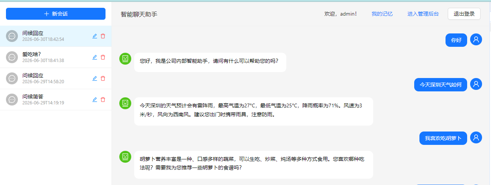
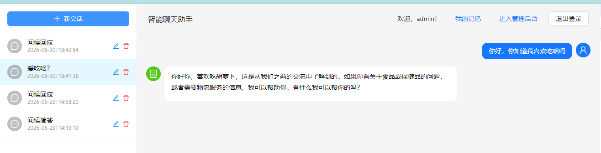
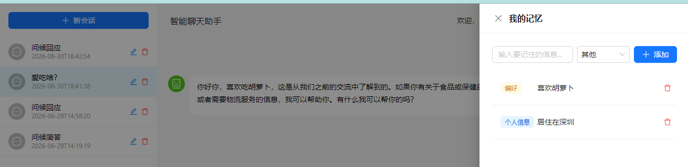
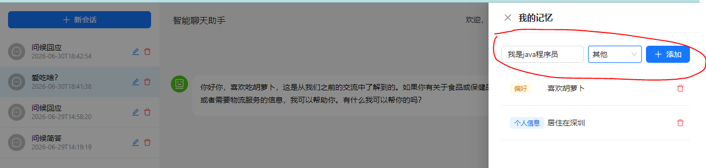
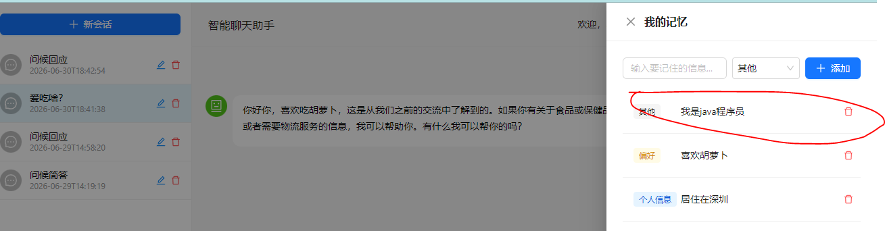

# 第6期：用户特征记忆与个性化对话

## 前言

第5期我们引入了 MCP 协议，实现了物流查询服务。经过前5期的迭代，项目已经具备了流式聊天、多轮对话、RAG 知识库、联网搜索、MCP 工具调用等能力。

但还有一个明显的短板：**AI 不记得用户是谁**。

每次对话都是"陌生人模式"——你说过喜欢简洁回答，下个会话 AI 又长篇大论；你提到过自己是 Java 开发，换个话题 AI 就忘了。传统的多轮对话记忆只在当前会话有效，跨会话就归零了。

这个问题在业内已有成熟方案——**用户特征记忆（User Feature Memory）**。ChatGPT 的 Memory 功能、豆包的"记住我的偏好"都属于这类能力。本期我们来实现它。

---

## 方案设计

用户特征记忆 ≠ 聊天记忆。两者的区别：

| 维度 | 聊天记忆 | 特征记忆 |
|------|---------|---------|
| 作用域 | 当前会话 | 全部会话 |
| 存储内容 | 对话原文 | 提炼后的用户画像 |
| 持久性 | 会话结束后可清理 | 长期保留 |
| 用途 | 保持上下文连贯 | 个性化回答 |

核心思路分三步：

```
会话 A: "我喜欢吃胡萝卜"
                │
                ▼
         AI 提取 → "用户喜欢吃胡萝卜"
                │
                ▼
         存入 user_memory 表
                │
                ▼
会话 B: "你知道我喜欢吃啥吗？"
                │
                ▼
        加载记忆 → 注入 system prompt
                │
                ▼
        AI: "你喜欢吃胡萝卜"
```

关键节点有两个：
1. **提取**：聊天结束后，AI 自动从对话中提取用户特征，去重写入
2. **注入**：每次聊天前，将已有记忆拼入 system prompt，让 AI 感知用户画像

---

## 数据库设计

新增 `user_memory` 表，用于持久化存储用户特征：

```sql
CREATE TABLE IF NOT EXISTS `user_memory` (
    `id` BIGINT AUTO_INCREMENT PRIMARY KEY,
    `user_id` BIGINT NOT NULL,
    `content` TEXT NOT NULL COMMENT '记忆内容，如"用户喜欢简洁回答"',
    `category` VARCHAR(32) NOT NULL DEFAULT 'OTHER' COMMENT 'PREFERENCE / PERSONAL_INFO / HABIT / OTHER',
    `source` VARCHAR(32) NOT NULL DEFAULT 'MANUAL' COMMENT 'CHAT_EXTRACT / MANUAL / SYSTEM',
    `source_conversation_id` VARCHAR(64) DEFAULT NULL COMMENT '来源会话ID',
    `confidence` INT DEFAULT 1 COMMENT '置信度，反复出现则递增',
    `created_at` DATETIME DEFAULT CURRENT_TIMESTAMP,
    `updated_at` DATETIME DEFAULT CURRENT_TIMESTAMP ON UPDATE CURRENT_TIMESTAMP,
    INDEX `idx_user_id` (`user_id`),
    INDEX `idx_category` (`category`)
) ENGINE=InnoDB DEFAULT CHARSET=utf8mb4 COMMENT='用户特征记忆表';
```

几个关键字段的设计意图：

- **`category`**：记忆分类（偏好/个人信息/习惯/其他），方便 UI 按类展示，也为未来按场景筛选埋下伏笔
- **`confidence`**：置信度。同一条记忆被多次验证则递增，避免"随口一说"被当成稳定特征
- **`source`**：区分是 AI 自动提取还是用户手动添加，用户手动添加的具有更高优先级

---

## 后端实现

### Entity 与枚举

```java
// MemoryCategory.java
public enum MemoryCategory {
    PREFERENCE,      // 偏好
    PERSONAL_INFO,   // 个人信息
    HABIT,           // 习惯
    OTHER            // 其他
}

// MemorySource.java
public enum MemorySource {
    CHAT_EXTRACT,    // AI 从聊天中提取
    MANUAL,          // 用户手动添加
    SYSTEM           // 系统预设
}
```

```java
// UserMemory.java
@Data
@TableName("user_memory")
public class UserMemory {
    @TableId(type = IdType.AUTO)
    private Long id;
    private Long userId;
    private String content;
    private String category;
    private String source;
    private String sourceConversationId;
    private Integer confidence;
    private LocalDateTime createdAt;
    private LocalDateTime updatedAt;
}
```

### Service 核心逻辑

服务层有四个核心方法：

**1. 记忆增删查**——标准的 MyBatis-Plus CRUD，走 lambdaQuery，按 `user_id` 隔离

**2. 记忆摘要生成**——将用户所有记忆拼接成自然语言文本，用于注入 system prompt：

```java
public String getMemoriesSummary(Long userId) {
    List<UserMemory> memories = listByUserId(userId);
    if (memories.isEmpty()) return "";
    return memories.stream()
            .map(m -> "- " + m.getContent())
            .collect(Collectors.joining("\n"));
}
```

输出示例：
```
- 用户喜欢吃胡萝卜
- 用户居住在深圳
- 用户是 Java 开发工程师
```

**3. AI 自动提取**——这是最核心的方法。每次聊天结束后，取最近 6 条消息（约 3 轮对话），调用 AI 进行分析：

```java
public void extractFromConversation(String conversationId, Long userId) {
    // 取最后 6 条消息
    List<Message> messages = messageService.lambdaQuery()
            .eq(Message::getConversationId, conversationId)
            .orderByDesc(Message::getCreatedAt)
            .last("LIMIT 6")
            .list();
    java.util.Collections.reverse(messages);
    if (messages.size() < 2) return;

    // 拼接对话文本
    String dialogText = messages.stream()
            .map(m -> (MessageRole.USER.name().equals(m.getRole()) ? "用户" : "AI") + ": " + m.getContent())
            .collect(Collectors.joining("\n"));

    // 已有记忆作为参考，供 AI 去重
    List<UserMemory> existingMemories = listByUserId(userId);
    String existingText = existingMemories.isEmpty() ? "无" :
            existingMemories.stream().map(UserMemory::getContent).collect(Collectors.joining("\n"));

    String prompt = """
            以下是最近一段对话。请从中提取用户透露的个人信息、偏好、习惯等特征。
            
            要求：
            - 只提取关于**用户本人**的特征，不要提取AI的表达
            - 分类请从以下选择：PREFERENCE（偏好）、PERSONAL_INFO（个人信息）、HABIT（习惯）
            - 输出格式：分类|内容，每行一条
            - 如果对话中没有新信息，直接输出"无"
            
            以下是用户已有的记忆，请忽略已存在的内容：
            %s
            
            对话：
            %s
            """.formatted(existingText, dialogText);

    String result = chatClient.prompt().user(prompt).call().content();
    // ... 解析结果，去重写入 ...
}
```

几个设计细节：

- **取 6 条而不是全量**：避免每次全量扫描历史，降低成本；同时保留足够上下文消除歧义（用户说"我喜欢"，AI 知道指的是胡萝卜而不是别的）
- **传已有记忆给 AI 参考**：让 AI 自行去重，避免重复提取
- **异步执行**：在 `doFinally` 中调用，不阻塞响应流

---

## Graph 改造：注入 System Prompt

这是让 AI "记住"用户的关键环节。在 `ConversationServiceImpl.chat()` 中构建 graph state 时，将用户记忆摘要传进去：

```java
// ChatNode.apply()
String userMemorySummary = state.value("userMemorySummary", "");
if (!userMemorySummary.isEmpty()) {
    systemPrompt += "\n\n以下是你对用户的了解（请基于这些信息个性化回答）：\n" + userMemorySummary;
}
```

如此一来，每次聊天时 AI 都会看到关于用户的特征描述，并据此调整回答风格和内容。

这里有个取舍：**新增的记忆要下一条消息才能生效**。因为提取逻辑在 `doFinally`（流结束后异步执行），当前的 response 已经发出去了，无法动态更新 system prompt。这个"延迟一个回合"对用户体验影响不大，但保持了架构的简洁。

---

## 前端实现

### API 封装

```js
// src/api/userMemory.js
import client from './client';

export const userMemoryApi = {
  list: () => client.get('/user/memory/list'),
  add: (body) => client.post('/user/memory/add', body),
  delete: (id) => client.delete(`/user/memory/delete/${id}`),
};
```

### UserMemoryDrawer 组件

用 Ant Design 的 `Drawer` 实现了一个记忆管理抽屉：

功能包括：
- **展示**：分类标签（偏好=金色、个人信息=蓝色、习惯=绿色）+ 内容
- **添加**：输入框 + 分类下拉选择 + 添加按钮，一行排布
- **删除**：带 Popconfirm 确认的删除按钮

```jsx
function UserMemoryDrawer({ open, onClose }) {
  // ... 状态管理 ...

  return (
    <Drawer title="我的记忆" open={open} onClose={onClose} width={400}>
      <div style={{ marginBottom: 16, display: 'flex', gap: 8 }}>
        <Input ... />
        <Select ... />    {/* 分类选择 */}
        <Button ... />    {/* 添加按钮 */}
      </div>
      <Table dataSource={memories} ...>
        {/* 分类标签列 | 内容列 | 删除操作列 */}
      </Table>
    </Drawer>
  );
}
```

### Chat 页面集成

在顶部栏新增"我的记忆"按钮，点击打开抽屉：

```jsx
<Button type="link" onClick={() => setMemoryDrawerOpen(true)} style={{ marginRight: 8 }}>
  我的记忆
</Button>
<UserMemoryDrawer open={memoryDrawerOpen} onClose={() => setMemoryDrawerOpen(false)} />
```

---

## 效果展示

### 场景：跨会话记住用户信息

**会话 A：**



**新会话 B：**



用户直接问"你知道我喜欢吃啥吗"，AI 准确回答出"喜欢吃胡萝卜"——因为 system prompt 中注入了用户记忆摘要。

**记忆管理界面：**



用户可以在抽屉中查看所有已记住的特征，支持手动添加和删除。





---

## 架构总览

经过 6 期迭代，项目架构如下：

```
┌─────────────────────────────────────────────────────────┐
│                    app-frontend (React)                  │
│  ┌──────────┐  ┌──────────┐  ┌──────────────────────┐  │
│  │ 会话列表  │  │ 消息列表  │  │ 消息输入(联网搜索开关) │  │
│  └──────────┘  └──────────┘  └──────────────────────┘  │
│  ┌──────────────────────────────────────────────────┐  │
│  │              UserMemoryDrawer                    │  │
│  │           (查看/添加/删除用户特征)                │  │
│  └──────────────────────────────────────────────────┘  │
└──────────────────────┬──────────────────────────────────┘
                       │ HTTP / SSE
                       ▼
┌─────────────────────────────────────────────────────────┐
│                 app (Spring Boot)                        │
│  ┌──────────┐  ┌──────────┐  ┌──────────────────────┐  │
│  │ 认证模块  │  │ 会话模块  │  │   ConversationService │  │
│  └──────────┘  └──────────┘  │   ┌───────────────┐  │  │
│  ┌──────────────────────┐    │   │ Graph State   │  │  │
│  │  UserMemoryService   │────┼──→│  +userId      │  │  │
│  │  ┌─────────────────┐ │    │   │  +userMemory  │  │  │
│  │  │ AI 自动提取      │ │    │   │  +message     │  │  │
│  │  │ 手动添加/删除    │ │    │   │  +ragContext  │  │  │
│  │  │ 生成记忆摘要      │ │    │   └──────┬────────┘  │  │
│  │  └─────────────────┘ │    └──────────┼─────────────│  │
│  └──────────┬───────────┘               │              │
│             │                           ▼              │
│             │                  ┌────────────────┐      │
│             │                  │   ChatNode     │      │
│             │                  │ systemPrompt   │      │
│             │                  │ + 用户特征摘要  │      │
│             │                  └────────────────┘      │
└─────────────┼───────────────────────────────────────────┘
              │
     ┌────────┴────────┐
     ▼                 ▼
┌──────────┐    ┌──────────┐
│  MySQL   │    │  Redis   │
│ user     │    │ token    │
│ user_memory│   │ checkpoint│
│ message  │    │ vector   │
│ conversation│  └──────────┘
│ document │
└──────────┘
```

---

## 踩坑记录

### 提取粒度：全量 vs 单条 vs 最近 N 条

最初想的是每次提取只分析用户最新的一条消息，省成本。测试发现不行：

```
用户：你喜欢吃胡萝卜吗
AI：我只是个AI，我没有偏好。
用户：我喜欢
```

单看"我喜欢"，AI 无法确定喜欢什么。改为分析最近 6 条消息后，上下文足够 AI 理解指代关系了。

---

## 下期预告

第6期实现了用户特征记忆，AI 能跨会话记住用户了。但目前的记忆存储是简单的表结构，只能精确匹配，无法做语义关联。

第7期将聚焦**多轮会话压缩**，解决长对话中 token 膨胀和上下文窗口溢出的问题，让聊天系统能稳定支持超长对话。

第6期完整代码已提交至 GitHub，欢迎 star 和讨论。
